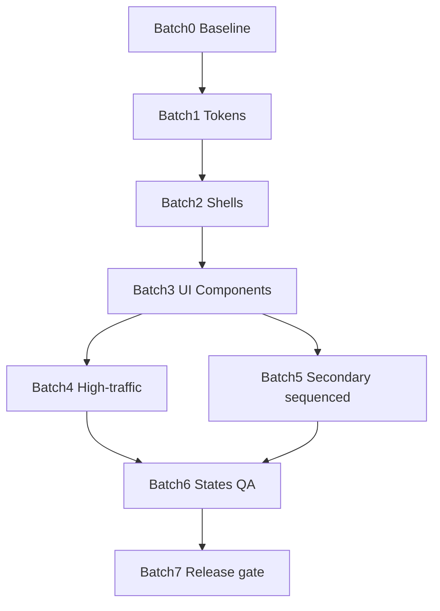

# Figma → Frontend Design Implementation Plan

**Branch:** `migrate/frontend`
**Figma source of truth:** [HyrePath](https://www.figma.com/design/8x0vctnbpqr6WAF7ACyG7I/HyrePath) (`8x0vctnbpqr6WAF7ACyG7I`)
**Plan date:** 2026-09-21 · **Figma twin last synced:** 2026-09-23
**Scope:** Visual / layout / component migration only — **no** business-logic rewrite, **no** API contract changes unless explicitly flagged below.

**Completeness note:** This revision fills prior gaps: §5.1 token table, §5.2 chrome decision, full §8 (61 routes), Batch 5 sequencing, §13 acceptance rubric, §14 dialog map, §15 orphan features, §16 motion, §17 screenshot method. **2026-09-23 update:** Figma twin now includes premium 3-color + full tablet/mobile coverage (see §3 Responsive). Merge/PR mechanics intentionally omitted.

---

## 1. Executive Summary

### Goal

Bring the **existing** Next.js frontend in line with the redesigned Figma twin (float sidebar shell, **premium 3-color**: neutrals + violet primary, **Desktop + Tablet + Mobile** content-parity screens) **without** rebuilding the product. Developers update tokens, shells, shared UI, then screens in batches.

**Figma twin status (2026-09-23):** Premium 3-color **and** responsive twin complete on file `8x0vctnbpqr6WAF7ACyG7I` — neutrals + violet; red only for destructive; no pastel surface mosaics; Documents table oxblood fills removed; **every ship screen has Desktop + Tablet (1024×768) + Mobile (390×844)** siblings. See `00 System` checklist *premium-3-color + responsive twin complete*.

### What is changing

| Layer | Change |
|-------|--------|
| Visual language | Float sidebar shell, cool-gray canvas, **violet** CTAs (`#7C5CFF`), white cards, charcoal text; **destructive red only on Delete/failed**; nav icons + section dividers. Pastel/door color slabs retired as surfaces. |
| Layout chrome | `AppSidebar` / `AppShell` spacing, radius, active nav treatment; marketing/auth card layouts; **tablet icon rail + mobile bottom nav** match Figma responsive shells |
| Shared components | Button, Badge, Card, Table, Dialog, Tabs, PageHeader, Empty/Skeleton — styled to Figma |
| Screen skins | All ~61 routes restyled to match Figma frames on pages `20–25` (desktop) **and** `20–25 · Responsive` (tablet/mobile) |

### What must stay working

- All existing routes under `frontend/app/**`
- Auth (`AuthGuard`, cookies, login/register/verify/invite)
- Staff doors (`StaffGuard` on `/desk`, `/osint`)
- Permission-filtered nav (`nav-config.ts` + `product-doors`)
- React Query / Redux data flows, OpenAPI clients
- Forms, tables, dialogs, impersonation, MFA, mocks (`FRONTEND_USE_MOCKS`)
- E2E smoke / unit tests

### Main risks

1. Shared component restyles cascade across Desk + Candidate + OSINT
2. Float shell vs current flush sidebar breaks responsive / bottom-nav assumptions
3. Frontend must now match **three** Figma viewports (desktop / tablet / mobile) — denser QA surface
4. Pastel misuse on primary buttons caused contrast bugs once — must encode `on-primary` rules; pastels are **retired as ship surfaces**
5. Parallel agents editing the same shell/components will conflict

### Recommended strategy

1. **Tokens first** → map Figma variables into `globals.css` / Tailwind
2. **Shells second** → Candidate / Desk / OSINT float chrome
3. **Primitives third** → `components/ui/*`
4. **Screens in door batches** → Marketing+Auth → Candidate → Desk → OSINT+Public
5. **QA gate** after each batch (build, lint, smoke, screenshot vs Figma)

---

## 2. Current Frontend Inventory

### Stack

| Item | Detail |
|------|--------|
| Framework | Next.js 15 App Router (`frontend/`) |
| UI | React 18, Tailwind 3, Radix primitives, CVA, Lucide |
| Fonts | IBM Plex Sans / Mono (`app/layout.tsx`) |
| Data | TanStack React Query, Redux Toolkit |
| Toasts | Sonner |
| Tests | Vitest unit, Playwright e2e (`FRONTEND_USE_MOCKS`) |
| Package | [`frontend/package.json`](frontend/package.json) |

### Route structure (61 `page.tsx`)

| Door | Prefix | Layout |
|------|--------|--------|
| Marketing | `/`, `/recruiters`, `/candidates`, `/journalists`, `/investors`, `/sales`, `/opt-out` | [`app/(marketing)/layout.tsx`](frontend/app/(marketing)/layout.tsx) + [`MarketingShell`](frontend/components/layout/MarketingShell.tsx) |
| Auth | `/login`, `/register`, `/verify-email`, `/verify-email-pending`, `/invite/[token]` | [`app/(auth)/layout.tsx`](frontend/app/(auth)/layout.tsx) |
| Candidate | `/app/**` | [`app/app/layout.tsx`](frontend/app/app/layout.tsx) → `AppShell` product=`candidate` |
| Desk | `/desk/**` | [`app/desk/layout.tsx`](frontend/app/desk/layout.tsx) → `StaffGuard` + `AppShell` product=`desk` |
| OSINT | `/osint/**` | [`app/osint/layout.tsx`](frontend/app/osint/layout.tsx) → `StaffGuard` + `AppShell` product=`osint` |
| Public | `/b/[slug]`, `/b/[slug]/[tier]`, `/p/[slug]` | No app shell |

### Major layout shells

| File | Role |
|------|------|
| [`components/layout/AppShell.tsx`](frontend/components/layout/AppShell.tsx) | Authenticated shell: sidebar + nav rail + topbar + bottom nav |
| [`AppSidebar.tsx`](frontend/components/layout/AppSidebar.tsx) | Desktop nav |
| [`AppNavRail.tsx`](frontend/components/layout/AppNavRail.tsx) | Compact rail |
| [`AppTopbar.tsx`](frontend/components/layout/AppTopbar.tsx) | Top chrome |
| [`AppBottomNav.tsx`](frontend/components/layout/AppBottomNav.tsx) | Mobile primary nav |
| [`ShellPage.tsx`](frontend/components/layout/ShellPage.tsx) | Page width / padding |
| [`MarketingShell.tsx`](frontend/components/layout/MarketingShell.tsx) | Public marketing chrome |
| [`nav-config.ts`](frontend/components/layout/nav-config.ts) | Nav sections + permission filters |

### Shared UI components (`components/ui/`)

`button`, `input`, `password-input`, `textarea`, `select`, `checkbox`, `radio-group`, `switch`, `label`, `tabs`, `table`, `card`, `badge`, `dialog`, `sheet`, `alert`, `tooltip`, `skeleton`, `progress`, `separator`, `collapsible`, `filter-bar`, `page-header`, `section-header`, `sonner`, `range-slider`

### Styling system

- CSS variables in [`frontend/app/globals.css`](frontend/app/globals.css) (HSL tokens: primary, surface, success/warning/info/destructive)
- Tailwind maps in [`frontend/tailwind.config.ts`](frontend/tailwind.config.ts)
- Utility classes: `app-surface`, `app-surface-muted`, `app-surface-elevated`
- **Gap vs Figma:** no violet-primary premium tokens, float-shell shadow, or responsive shell styling in CSS yet (pastel mosaic tokens must **not** be reintroduced as KPI/table fills)

### State / data fetching

- Feature hooks under `frontend/features/**` (React Query)
- Auth: [`providers/auth-provider.tsx`](frontend/providers/auth-provider.tsx)
- API routes proxy under `frontend/app/api/**`
- Mocks: `FRONTEND_USE_MOCKS` + `src/lib/mocks`

### Auth / permissions

| Guard | File | Used by |
|-------|------|---------|
| `AuthGuard` | [`components/auth/auth-guard.tsx`](frontend/components/auth/auth-guard.tsx) | Candidate app |
| `StaffGuard` | [`components/auth/staff-guard.tsx`](frontend/components/auth/staff-guard.tsx) | Desk + OSINT layouts |
| Product doors | [`src/lib/product-doors.ts`](frontend/src/lib/product-doors.ts) | Nav filtering |
| Verification banner | `components/auth/verification-banner.tsx` | AppShell |
| Impersonation | `features/admin` | AppShell |

### Form / table / modal patterns

- Forms: Radix + Label/Input in feature components (e.g. outreach, MFA, brands)
- Tables: `components/ui/table` + feature tables (`UsersTable`, desk queues)
- Modals: `Dialog` / `Sheet` — Draft outreach, Impersonate, Create brand, Add job, Delete account, MFA disable prompts
- Toasts: Sonner

---

## 3. Figma Design Inventory

**File:** https://www.figma.com/design/8x0vctnbpqr6WAF7ACyG7I/HyrePath

Inspected via Figma MCP (2026-09-23). Status on `00 System`: **premium-3-color + responsive twin complete** (neutrals + violet; destructive red controls only; no oxblood table fills; all ship screens have Tablet + Mobile siblings).

### Pages / sections

| Figma page | Contents |
|------------|----------|
| `00 System` | Cover + coverage checklist (premium + responsive) |
| `10 Foundations` | Color/spacing/radius tokens (premium 3-color; pastels retired as ship surfaces) |
| `11 Components` | Buttons, chips, KPI, nav, chart legend + **Responsive patterns** strip |
| `12 Shells` | Desktop: `Shell / Candidate`, `Shell / Desk`, `Shell / OSINT`. Responsive: each door × **Tablet** (1024×768) + **Mobile** (390×844) |
| `13 Prototype` | Door map — Desktop + Tablet + Mobile |
| `20 Marketing` | 7 routes (desktop) |
| `20 Marketing · Responsive` | 7 × Mobile + 7 × Tablet (14) |
| `21 Auth` | 5 routes (desktop; single-column white cards, violet accents) |
| `21 Auth · Responsive` | 5 × Mobile + 5 × Tablet (10) |
| `22 Candidate App` | ~24 routes + dialogs (desktop) |
| `22 Candidate · Responsive` | 24 × Mobile + 24 × Tablet (48) |
| `23 Desk` | ~26 routes + dialogs (desktop) |
| `23 Desk · Responsive` | 26 × Mobile + 26 × Tablet (52) |
| `24 OSINT` | 6 routes + MFA dialog (desktop) |
| `24 OSINT · Responsive` | 6 × Mobile + 6 × Tablet (12) |
| `25 Public` | 3 routes (desktop) |
| `25 Public · Responsive` | 3 × Mobile + 3 × Tablet (6) |
| `90 Archive Twin` | 61 pixel captures of pre-redesign UI (reference only — **do not ship**) |

**Responsive artboard total:** ~142 Mobile/Tablet frames + 6 responsive shell components (in addition to desktop `20–25`).

### Design system tokens (Figma variables)

**Semantic (implement in CSS):**

- Surfaces: `color/bg/page`, `surface`, `soft`, `muted`, `primary`
- Text: `color/text/primary`, `muted`, `on-primary`
- Border: `color/border/default`
- Doors: `color/door/{candidate,desk,osint}` + `-soft`
- Status: `color/status/{success,info,warning,danger}` + `-soft`
- Pastels: **retired as ship surfaces** (legacy variables may remain — do not use for KPI/table fills)
- Hard rule: **never** use `color/status/danger` as table row or large panel fill — Delete/failed controls only
- Charts: violet + light violet + gray (max 3 series)
- Charts: `color/chart/1..4`
- Radius: `radius/sm|md|lg|xl`
- Spacing: `spacing/xs` … `2xl`

### Navigation patterns

- **Desktop:** Float rounded sidebar on cool-gray page canvas (14px outer padding)
- **Tablet:** Icon rail + topbar (`Shell / {Door} · Tablet`)
- **Mobile:** Bottom nav (3 primary + More) + topbar (`Shell / {Door} · Mobile`); More sheet preserves Main / System / OSINT category dividers
- Section labels + **violet** active soft fill (`#EFEAFF`)
- Lucide-equivalent **icons** on every nav row; **category divider** between Main↔System and OSINT↔System (Desk: divider before footer)
- Candidate / Desk / OSINT product-specific item lists (mirror `nav-config.ts`)

### Variants / states present in Figma

- Primary / secondary / destructive buttons
- Status chips (Done / Live / Needs review / Failed)
- KPI mosaic strips (desktop) → 2-up / horizontal cards on tablet/mobile
- Dialog artboards named `NN /path · Dialog: {name}` (desktop) + `· Mobile` / `· Tablet` sheet/modal variants on Responsive pages
- Empty-state copy on many screens
- Auth: success path + verification failed
- Responsive patterns on `11 Components`: bottom nav, icon rail, filter sheet, list card, sticky CTA

### Responsive (designed — ship against these)

| Viewport | Frame size | Chrome | Figma source |
|----------|------------|--------|--------------|
| Desktop | ~1440×900 | Float sidebar | Pages `20–25`, `12 Shells` desktop |
| Tablet | **1024×768** | Icon rail + topbar | `NN · Responsive` · Tablet + `Shell / * · Tablet` |
| Mobile | **390×844** | Bottom nav + topbar | `NN · Responsive` · Mobile + `Shell / * · Mobile` |

**UX adaptation rules (Figma already applies; frontend should match):**

- Tables → stacked cards / compact list rows; Delete stays red **control** only
- KPI mosaics → 2-up (tablet) or horizontal snap (mobile)
- Filter bars → Filters chip → bottom sheet
- Multi-column forms → single column; sticky primary CTA above bottom nav
- Desktop dialogs → full-width bottom sheets (mobile) / centered modal (tablet)
- Split panes → list push → detail on mobile
- Tap targets ≥ 44px; bottom-nav clearance ~72px
- Marketing / Auth / Public: stacked full-bleed / single-column; **no** app bottom nav

Frame naming: `{desktop name} · Tablet` / `{desktop name} · Mobile` (e.g. `22 /app/documents · Mobile`).

### Could not fully inspect

- Exact pixel spacing measurements for every nested auto-layout (use Foundations + shell frames as source)
- Interactive hover/focus variants beyond static fills
- Archive Twin used only as pre-redesign reference

---

## 4. Screen Mapping Table

| Figma Screen | Current Route/File | Match Status | Required Change | Risk Level | Notes |
|--------------|-------------------|--------------|-----------------|------------|-------|
| `20 /` | [`app/page.tsx`](frontend/app/page.tsx) | Route exists but UI needs redesign | Marketing hero + use-case mosaic | Med | Also match `20 / · Mobile` / `· Tablet` |
| `20 /recruiters` | [`(marketing)/recruiters/page.tsx`](frontend/app/(marketing)/recruiters/page.tsx) | Route exists but UI needs redesign | Persona landing skin | Low | Responsive siblings exist |
| `20 /candidates` | [`(marketing)/candidates/page.tsx`](frontend/app/(marketing)/candidates/page.tsx) | Route exists but UI needs redesign | Persona landing skin | Low | Responsive siblings exist |
| `20 /journalists` | [`(marketing)/journalists/page.tsx`](frontend/app/(marketing)/journalists/page.tsx) | Route exists but UI needs redesign | Persona landing skin | Low | Responsive siblings exist |
| `20 /investors` | [`(marketing)/investors/page.tsx`](frontend/app/(marketing)/investors/page.tsx) | Route exists but UI needs redesign | Persona landing skin | Low | Responsive siblings exist |
| `20 /sales` | [`(marketing)/sales/page.tsx`](frontend/app/(marketing)/sales/page.tsx) | Route exists but UI needs redesign | Persona landing skin | Low | Responsive siblings exist |
| `20 /opt-out` | [`opt-out/page.tsx`](frontend/app/opt-out/page.tsx) | Route exists but UI needs redesign | Mode toggles + form skin | Med | Keep form logic |
| `21 /login` | [`(auth)/login/page.tsx`](frontend/app/(auth)/login/page.tsx) | Route exists but UI needs redesign | White card + violet brand (no pastel side panel) | Med | Contrast fixed in Figma |
| `21 /register` | [`(auth)/register/page.tsx`](frontend/app/(auth)/register/page.tsx) | Route exists but UI needs redesign | White card; single-column on mobile | Med | Keep field set |
| `21 /verify-email` | [`(auth)/verify-email/page.tsx`](frontend/app/(auth)/verify-email/page.tsx) | Route exists but UI needs redesign | Failed state card | Low | |
| `21 /verify-email-pending` | [`(auth)/verify-email-pending/page.tsx`](frontend/app/(auth)/verify-email-pending/page.tsx) | Route exists but UI needs redesign | Pending card | Low | |
| `21 /invite/[token]` | [`invite/[token]/page.tsx`](frontend/app/invite/[token]/page.tsx) | Route exists but UI needs redesign | White card + form | Med | |
| `22 /app` | [`app/app/page.tsx`](frontend/app/app/page.tsx) | Route exists but UI needs redesign | Matches hub (same as matches) | Med | Figma treats as Job matches |
| `22 /app/dashboard` | [`app/dashboard/page.tsx`](frontend/app/app/dashboard/page.tsx) | Route exists but UI needs redesign | KPI mosaic + table | Med | |
| `22 /app/matches` | [`app/matches/page.tsx`](frontend/app/app/matches/page.tsx) | Route exists but UI needs redesign | KPI + job cards; **Apply = on-primary** | High | Contrast regression risk |
| `22 /app/matches/swipe` | [`app/matches/swipe/page.tsx`](frontend/app/app/matches/swipe/page.tsx) | Route exists but UI needs redesign | Swipe deck skin | Med | |
| `22 /app/matches/settings` | [`app/matches/settings/page.tsx`](frontend/app/app/matches/settings/page.tsx) | Route exists but UI needs redesign | Preference form | Low | |
| `22 /app/documents` | [`app/documents/page.tsx`](frontend/app/app/documents/page.tsx) | Route exists but UI needs redesign | Upload well + table | High | Dense |
| `22 /app/documents/[documentId]` | [`app/documents/[documentId]/page.tsx`](frontend/app/app/documents/[documentId]/page.tsx) | Route exists but UI needs redesign | Detail + AI feedback | Med | |
| `22 /app/practice` (+ session + report) | `app/practice/**` | Route exists but UI needs redesign | Setup / session / report | Med | |
| `22 /app/tracker` | [`app/tracker/page.tsx`](frontend/app/app/tracker/page.tsx) | Route exists but UI needs redesign | Tracker + Add job dialog | Med | |
| `22 /app/outreach` | [`app/outreach/page.tsx`](frontend/app/app/outreach/page.tsx) | Route exists but UI needs redesign | List + Draft dialog | Med | |
| `22 /app/portfolio` | [`app/portfolio/page.tsx`](frontend/app/app/portfolio/page.tsx) | Route exists but UI needs redesign | Editor skin | Low | |
| `22 /app/settings` (+ security) | `app/settings/**` | Route exists but UI needs redesign | Settings + MFA + delete dialog | Med | |
| `22 /app/privacy` | [`app/privacy/page.tsx`](frontend/app/app/privacy/page.tsx) | Route exists but UI needs redesign | Privacy cards | Low | |
| `22 /app/jobs` (+ `[id]`) | `app/jobs/**` | Route exists but UI needs redesign | Job list/detail | Med | |
| `22 /app/history` | [`app/history/page.tsx`](frontend/app/app/history/page.tsx) | Route exists but UI needs redesign | History table | Low | |
| `22 /app/health` | [`app/health/page.tsx`](frontend/app/app/health/page.tsx) | Route exists but UI needs redesign | Health cards | Low | |
| `23 /desk` | [`desk/page.tsx`](frontend/app/desk/page.tsx) | Route exists but UI needs redesign | Ops home KPIs | Med | |
| `23 /desk/system-health` | [`desk/system-health/page.tsx`](frontend/app/desk/system-health/page.tsx) | Route exists but UI needs redesign | Health panels | Med | |
| `23 /desk/sourcing-leads` | [`desk/sourcing-leads/page.tsx`](frontend/app/desk/sourcing-leads/page.tsx) | Route exists but UI needs redesign | Lead form + table | High | Unique form |
| `23 /desk/linkedin-tasks` | [`desk/linkedin-tasks/page.tsx`](frontend/app/desk/linkedin-tasks/page.tsx) | Route exists but UI needs redesign | Tasks + Create batch dialog | Med | |
| `23 /desk/brands` | [`desk/brands/page.tsx`](frontend/app/desk/brands/page.tsx) | Route exists but UI needs redesign | Brands + Create dialog | Med | |
| `23 /desk/roles` | [`desk/roles/page.tsx`](frontend/app/desk/roles/page.tsx) | Route exists but UI needs redesign | Roles matrix | Med | |
| `23 /desk/staff-invites` | [`desk/staff-invites/page.tsx`](frontend/app/desk/staff-invites/page.tsx) | Route exists but UI needs redesign | Invites table | Low | |
| `23 /desk/feature-flags` | [`desk/feature-flags/page.tsx`](frontend/app/desk/feature-flags/page.tsx) | Route exists but UI needs redesign | Flags table | Low | |
| `23 /desk/analytics` | [`desk/analytics/page.tsx`](frontend/app/desk/analytics/page.tsx) | Route exists but UI needs redesign | KPI mosaic + chart legend | Med | |
| `23 /desk/demand-intelligence` | [`desk/demand-intelligence/page.tsx`](frontend/app/desk/demand-intelligence/page.tsx) | Route exists but UI needs redesign | Demand panels | Med | |
| `23 /desk/signals` | [`desk/signals/page.tsx`](frontend/app/desk/signals/page.tsx) | Route exists but UI needs redesign | Signals queue | Med | |
| `23 /desk/queues` | [`desk/queues/page.tsx`](frontend/app/desk/queues/page.tsx) | Route exists but UI needs redesign | Queue table | Med | |
| `23 /desk/users` (+ detail) | `desk/users/**` | Route exists but UI needs redesign | Users + Impersonate dialog | High | Permissions |
| `23 /desk/audit-logs` | [`desk/audit-logs/page.tsx`](frontend/app/desk/audit-logs/page.tsx) | Route exists but UI needs redesign | Audit table | Low | |
| `23 /desk/review-queue` | [`desk/review-queue/page.tsx`](frontend/app/desk/review-queue/page.tsx) | Route exists but UI needs redesign | Review + decision dialog | High | |
| `23 /desk/job-postings` | [`desk/job-postings/page.tsx`](frontend/app/desk/job-postings/page.tsx) | Route exists but UI needs redesign | Postings + hide reason dialog | Med | |
| `23 /desk/documents` | [`desk/documents/page.tsx`](frontend/app/desk/documents/page.tsx) | Route exists but UI needs redesign | Moderation table | Med | |
| `23 /desk/portfolio` | [`desk/portfolio/page.tsx`](frontend/app/desk/portfolio/page.tsx) | Route exists but UI needs redesign | Portfolio moderation | Low | |
| `23 /desk/outreach` | [`desk/outreach/page.tsx`](frontend/app/desk/outreach/page.tsx) | Route exists but UI needs redesign | Outreach moderation | Low | |
| `23 /desk/ai-actions` | [`desk/ai-actions/page.tsx`](frontend/app/desk/ai-actions/page.tsx) | Route exists but UI needs redesign | AI actions table | Low | |
| `24 /osint` | [`osint/page.tsx`](frontend/app/osint/page.tsx) | Route exists but UI needs redesign | Full intake UI | High | Densest |
| `24 /osint/jobs` (+ `[id]`) | `osint/jobs/**` | Route exists but UI needs redesign | History + dossier | High | |
| `24 /osint/settings` (+ security) | `osint/settings/**` | Route exists but UI needs redesign | Settings + MFA | Med | |
| `25 /b/[slug]` (+ tier) | `b/[slug]/**` | Route exists but UI needs redesign | Brand landing skin | Low | CMS-dependent |
| `25 /p/[slug]` | [`p/[slug]/page.tsx`](frontend/app/p/[slug]/page.tsx) | Route exists but UI needs redesign | Public portfolio | Low | |
| Dialog frames (10+) | Feature dialogs in `features/**` | Partial match | Restyle dialog chrome; mobile = bottom sheet per Responsive artboards | Med | Keep behavior |
| — | API routes `app/api/**` | Exists in frontend but missing in Figma | **No visual work** | — | Out of scope |
| — | Middleware / subdomain | Exists in frontend but missing in Figma | **No visual work** | — | |
| Hover/focus variants | — | Static only in Figma | Keep Radix focus rings | Med | See §11 |

**Summary:** ~61 Figma desktop route frames ↔ 61 frontend pages — **no missing routes**. Tablet + Mobile siblings exist for every ship screen on `· Responsive` pages. Work is **UI redesign** (3 viewports), not greenfield screens.

---

## 5. Shared Design System Plan

| Item | Existing | Figma ref | Required change | Blocks screens? |
|------|----------|-----------|-----------------|-----------------|
| Typography | IBM Plex in layout; Inter in Figma | Foundations | **Keep IBM Plex** in app; match Figma sizes/weights | Soft block |
| Spacing | Tailwind + ad hoc | `spacing/*` | Prefer 4/8/12/16/24/32 | Yes |
| Colors | `globals.css` sage/forest (legacy) | Premium 3-color: neutrals + **violet primary**; status chips; **no pastel ship surfaces** | Add CSS vars; map Tailwind (§5.1) — primary is violet `#7C5CFF` | **Yes** |
| Radius | `--radius: 0.875rem` | `radius/md|lg|xl` | Shell `rounded-2xl`, cards `rounded-xl` | Yes |
| Shadows | `shadow-panel` | Float shell | Add `--shadow-float-sidebar` | Yes |
| Buttons | `ui/button.tsx` | Components | Primary → `primary-foreground` only | **Yes** |
| Inputs | `ui/input.tsx` | Auth/forms | Soft border, page fill | Yes |
| Selects / checkbox / radio | `ui/*` | Forms | Visual only | Soft |
| Tabs | `ui/tabs.tsx` | Active violet-soft | Active = primary-soft | Yes |
| Tables | `ui/table.tsx` | Desk tables (white/zebra; no danger row fills) | Header accent; row hover; mobile → cards | Yes |
| Cards | `ui/card.tsx` | KPI / list cards | White + violet accents (not pastel fills) | Yes |
| Badges | `ui/badge.tsx` | Status chips | Status soft/solid variants | Yes |
| Modals / sheets | `ui/dialog.tsx`, `ui/sheet.tsx` | Dialog + Responsive sheet artboards | Surface card; danger CTAs; mobile sheets | Soft |
| Toasts | Sonner | — | Keep; align primary colors | No |
| Empty / loading | Skeleton + ad hoc | Empty copy | Prefer shared empty pattern | Soft |
| Page headers | `ui/page-header.tsx` | H1 patterns | Match title/description | Soft |
| Sidebar / nav | `AppSidebar` etc. | `12 Shells` desktop + Tablet/Mobile | Float shell + rail + bottom nav (§5.2) | **Yes** |
| Containers | `ShellPage` | Main surface | Outer padding + rounded Main | **Yes** |

**Hard rule:** Never put ink text on `bg-primary` or `bg-destructive` without `*-foreground`. Never use destructive/danger as table-row or large content-surface fills. Never reintroduce pastel KPI/table panel fills.

### 5.1 Concrete token mapping (Batch 1 deliverable)

Implement these in [`globals.css`](frontend/app/globals.css) + [`tailwind.config.ts`](frontend/tailwind.config.ts). HSL values are approximate from Figma primitives (refine from Foundations swatches if needed).

| Figma variable | CSS variable | Approx HSL | Tailwind key | Usage |
|----------------|--------------|------------|--------------|-------|
| `color/bg/page` | `--background` (exists) | `240 11% 96%` | `background` | Cool-gray page canvas |
| `color/bg/surface` | `--surface` (exists) | `0 0% 100%` | `surface` | Cards / Main |
| `color/bg/soft` | `--primary-soft` (exists) | `252 100% 96%` | `primary-soft` | Violet soft fills |
| `color/bg/primary` | `--primary` (exists) | `252 100% 68%` | `primary` | Violet CTA fill `#7C5CFF` |
| `color/text/on-primary` | `--primary-foreground` | `0 0% 100%` | `primary-foreground` | CTA text |
| `color/text/primary` | `--foreground` | `152 16% 11%` | `foreground` | Body |
| `color/text/muted` | `--muted-foreground` | `96 2% 37%` | `muted-foreground` | Secondary |
| `color/border/default` | `--border` | `90 10% 84%` | `border` | Borders |
| `color/door/candidate` | `--door-candidate` | optional label accent | `door-candidate` | Optional section label (active fill is violet-soft) |
| `color/door/candidate-soft` | `--door-candidate-soft` | prefer `--primary-soft` | `door-candidate-soft` | Prefer violet-soft for active nav |
| `color/door/desk` | `--door-desk` | optional label accent | `door-desk` | Optional |
| `color/door/desk-soft` | `--door-desk-soft` | prefer `--primary-soft` | `door-desk-soft` | Prefer violet-soft |
| `color/door/osint` | `--door-osint` | optional label accent | `door-osint` | Optional |
| `color/door/osint-soft` | `--door-osint-soft` | prefer `--primary-soft` | `door-osint-soft` | Prefer violet-soft |
| `color/status/success` | `--success` (exists) | `144 39% 30%` | `success` | Done chips |
| `color/status/success-soft` | `--success-soft` | `144 35% 92%` | `success-soft` | Chip bg |
| `color/status/info` | `--info` (exists) | `188 57% 35%` | `info` | Live chips |
| `color/status/info-soft` | `--info-soft` | `188 45% 92%` | `info-soft` | Chip bg |
| `color/status/warning` | `--warning` (exists) | `36 88% 46%` | `warning` | Review chips |
| `color/status/warning-soft` | `--warning-soft` | `40 80% 92%` | `warning-soft` | Chip bg |
| `color/status/danger` | `--destructive` (exists) | `0 72% 51%` | `destructive` | Delete / Failed controls only (`#DC2626`) |
| `color/status/danger-soft` | `--destructive-soft` | `0 86% 97%` | `destructive-soft` | Chip bg only — not table fills |
| `color/chart/1` | `--chart-1` | violet ≈ primary | `chart-1` | Series 1 |
| `color/chart/2` | `--chart-2` | violet-soft | `chart-2` | Series 2 |
| `color/chart/3` | `--chart-3` | muted gray | `chart-3` | Series 3 |
| `color/chart/4` | `--chart-4` | border gray | `chart-4` | Optional |
| Float shadow | `--shadow-float-sidebar` | soft violet-tinted drop | `shadow-float-sidebar` | Sidebar |

**Retired (do not map into ship CSS as KPI/table fills):** `color/pastel/*` — legacy variables may remain in Figma Foundations for reference only.

**KPI rule:** White cards + violet accents / gray secondary. Failed/Blocked/Error chips → `destructive` / `destructive-soft` only — never oxblood/danger row fills.

### 5.2 App chrome decision vs Figma (locked for Batch 2)

Figma now designs **all three** chrome modes. Align breakpoints to existing app (`md` / `lg`) unless Product changes them.

| Chrome | Figma | Decision for migration |
|--------|-------|------------------------|
| `AppSidebar` | Yes (float desktop) | **Restyle** to float + violet active soft |
| `ShellPage` / Main | Yes | **Restyle** rounded surface on padded canvas |
| `AppTopbar` | Yes on Tablet + Mobile shells | **Keep**; restyle to match responsive shells (search/avatar) |
| `AppNavRail` | Yes — `Shell / * · Tablet` | **Keep** for mid breakpoints (`md`–`lg`); restyle active to violet-soft |
| `AppBottomNav` | Yes — `Shell / * · Mobile` + Responsive patterns | **Keep** for `<md` (or `<lg` per current app); restyle active to violet-soft; primary items + More per `nav-config` |
| Filter sheets / list cards | `11 Components` Responsive strip | Prefer `Sheet` + card lists on mobile |
| Marketing / Auth / Public | Dedicated desktop + Responsive pages | Match Figma; no AppShell |

---

## 6. Implementation Batches

### Batch 0 — Safety and Baseline

**Purpose:** Confirm app runs; capture before state.

**Deliverables:**

- [ ] `FRONTEND_USE_MOCKS=true npm run dev` healthy on `:3000`
- [ ] Route inventory (§2 / §4 / §8) acknowledged
- [ ] Screenshot baseline: `/`, `/login`, `/app/matches`, `/desk`, `/osint`, `/app/documents`
- [ ] `npm run lint` + `typecheck` + `test:unit` green
- [ ] Risk list (§9) acknowledged

**Owner:** Agent G + H

---

### Batch 1 — Design Tokens and Global Styling

**Files:** `frontend/app/globals.css`, `frontend/tailwind.config.ts`

**Deliverables:**

- [ ] All §5.1 variables landed
- [ ] Tailwind keys wired
- [ ] `shadow-float-sidebar` utility
- [ ] No shell structure changes yet

---

### Batch 2 — Layout Shells

**Files:** `AppShell.tsx`, `AppSidebar.tsx`, `AppNavRail.tsx`, `AppTopbar.tsx`, `AppBottomNav.tsx`, `ShellPage.tsx`, `MarketingShell.tsx`, `(auth)/layout.tsx`

**Deliverables:**

- [ ] Float sidebar + violet active soft; tablet rail + mobile bottom nav per §5.2
- [ ] Main rounded surface
- [ ] Auth white card + violet brand (no pastel side panel); match Responsive Auth frames
- [ ] Guards unchanged; shell unit tests pass

**Figma:** `12 Shells` (desktop + Tablet/Mobile), `21 Auth`, `21 Auth · Responsive`

---

### Batch 3 — Core Reusable Components

**Files:** `frontend/components/ui/*`

**Deliverables:**

- [ ] Button contrast lock
- [ ] Badge status + Card utilities (white / violet-soft — **no** pastel KPI fills)
- [ ] Table header / Tabs active / Dialog+Sheet chrome (mobile sheets)
- [ ] ClassName-only unit test updates

**Figma:** `11 Components` (+ Responsive patterns strip)

---

### Batch 4 — High-Traffic Screens

| Order | Screen | Primary feature files | Owner | Risk |
|-------|--------|----------------------|-------|------|
| 4.1 | Marketing `/` | `features/marketing/**`, `app/page.tsx` | E | Med |
| 4.2 | Auth ×5 | `(auth)/**`, `invite/**` | E | Med |
| 4.3 | `/app` + `/app/matches` | `features/job-matching/**`, `job-swipe/**` | E | High |
| 4.4 | `/app/documents` | `features/documents/**`, `cv-management/**` | E | High |
| 4.5 | `/app/dashboard` | `features/dashboard/**` | E | Med |
| 4.6 | `/osint` | `features/enrich/**`, dossier components | F | High |
| 4.7 | `/desk` + system-health | `features/admin` SystemHealthPanel | F | Med |
| 4.8 | `/desk/users` + detail | `UsersTable`, `UserDetailDrawer`, Impersonate | F | High |
| 4.9 | `/desk/review-queue` | `ReviewQueueTable`, `ReviewQueueDetail` | F | High |

**DoD:** §13 acceptance rubric pass for each.

---

### Batch 5 — Secondary Screens (sequenced)

Work **after** Batch 3. Within Batch 5, order by shared dependency (tables/forms first where possible). E and F stay door-split.

#### 5A — Candidate secondary (Agent E) — order

1. `/app/matches/settings` → `features/job-matching` PreferencesForm
2. `/app/matches/swipe` → `features/job-swipe` (preserve Framer Motion; skin cards only — §16)
3. `/app/tracker` + Add job dialog → `TrackerView`, `AddManualJobDialog`
4. `/app/outreach` + Draft dialog → `OutreachView`, `DraftOutreachDialog`
5. `/app/practice` → session → report → `features/practice`, `jd-practice`
6. `/app/portfolio` → `features/portfolio`
7. `/app/settings` + Delete dialog → `SettingsView`
8. `/app/settings/security` + MFA → `MfaSetupCard`
9. `/app/privacy`, `/app/jobs`, `/app/jobs/[id]`, `/app/history`, `/app/health`
10. Marketing personas + `/opt-out` (if not done in 4.1)

#### 5B — Desk secondary (Agent F) — order

1. Shared moderation table chrome already from Batch 3 — then:
2. `/desk/queues` → `QueueMonitor`
3. `/desk/signals` → `features/signals`
4. `/desk/job-postings` (+ hide reason) → `JobPostingsModerationPanel`
5. `/desk/documents` → `DocumentsModerationPanel`
6. `/desk/portfolio` → `PortfolioModerationPanel`
7. `/desk/outreach` → `OutreachModerationPanel`
8. `/desk/ai-actions` → `AiActionsTable`
9. `/desk/audit-logs` → `AuditLogTable`
10. `/desk/brands` (+ Create/Edit dialog inline) → `desk/brands/page.tsx`
11. `/desk/sourcing-leads` → `SourcingLeadsPanel`
12. `/desk/linkedin-tasks` (+ Create batch) → `LinkedInTasksPanel`
13. `/desk/roles`, `/desk/staff-invites`, `/desk/feature-flags`
14. `/desk/analytics`, `/desk/demand-intelligence` → admin Analytics + DemandIntelligencePanel

#### 5C — OSINT + Public (Agent F) — order

1. `/osint/jobs` → list
2. `/osint/jobs/[id]` → dossier detail
3. `/osint/settings` + `/osint/settings/security`
4. `/b/[slug]`, `/b/[slug]/[tier]` → `features/brand-pages`
5. `/p/[slug]` → `PublicPortfolioPage`

---

### Batch 6 — Edge States and Responsive QA

- [ ] Empty / loading / error for all High + Med screens in §8
- [ ] Permission: candidate blocked from `/desk`/`/osint`
- [ ] All §14 dialogs open/submit/cancel; mobile sheet variants behave
- [ ] Tablet (`md`–`lg`): icon rail + topbar match `Shell / * · Tablet`
- [ ] Mobile (`<md` or current `<lg`): bottom nav + More match `Shell / * · Mobile`
- [ ] Tables degrade to cards / list rows per Responsive UX rules (§3)
- [ ] Visual bug list

---

### Batch 7 — Final Integration and Release Gate

- [ ] Desktop screenshot vs Figma for all §8 routes (or sampled High+Med with Low spot-check)
- [ ] Spot-check Tablet + Mobile vs `· Responsive` frames for High screens
- [ ] lint / typecheck / unit / smoke green
- [ ] Remaining gaps listed (hover/focus variants only — mobile Figma delivered)
- [ ] Release recommendation when gate green

---

## 7. Parallel Agent Assignment Plan

| Agent | Scope | Owns | Must not touch | Inputs | Output | DoD |
|-------|-------|------|----------------|--------|--------|-----|
| **A — Mapper** | Keep §4/§8/§14 current | Plan docs | App code | Figma + routes | Mapping updates | Tables accurate |
| **B — Tokens** | Batch 1 | `globals.css`, `tailwind.config.ts` | Shells/screens | §5.1 | Token PR | Keys usable |
| **C — Shells** | Batch 2 | `components/layout/**`, auth/marketing layouts | Feature pages | Tokens | Shell PR | §5.2 done |
| **D — Components** | Batch 3 | `components/ui/**` | Features | Tokens | UI PR | Contrast lock |
| **E — Screens G1** | 4.1–4.5 + 5A | marketing, auth, `app/app/**`, listed features | Desk/OSINT | Shells+UI | Screen PRs | §13 pass |
| **F — Screens G2** | 4.6–4.9 + 5B + 5C | desk, osint, public, admin/signals/enrich | Candidate features | Shells+UI | Screen PRs | §13 pass |
| **G — QA** | 0, 6, 7 | e2e / screenshots | Product logic | All PRs | Bug list | Smoke green |
| **H — Integrator** | Sequencing | Conflicts / order | Drive-by refactors | All agents | Integration | Gate |

**Conflict rule:** Serialize B → C → D. Then E ∥ F.

**Feature-layer rule:** Prefer editing `features/**` components over `page.tsx` when the page only composes a panel (most Desk routes).

---

## 8. Screen-by-Screen Implementation Checklist (all 61)

**Status column:** update during work (`todo` default).

**QA mini-check (every row):** [ ] desktop screenshot vs Figma [ ] CTA contrast [ ] nav/door (if shelled) [ ] empty/loading if shown in Figma [ ] no API/hook signature change

| Route | Figma frame | Page file | Primary feature / UI files | Auth | Risk | Owner | Status |
|-------|-------------|-----------|---------------------------|------|------|-------|--------|
| `/` | `20 /` | `app/page.tsx` | `features/marketing/**` | Public | Med | E | todo |
| `/recruiters` | `20 /recruiters` | `(marketing)/recruiters/page.tsx` | marketing persona | Public | Low | E | todo |
| `/candidates` | `20 /candidates` | `(marketing)/candidates/page.tsx` | marketing persona | Public | Low | E | todo |
| `/journalists` | `20 /journalists` | `(marketing)/journalists/page.tsx` | marketing persona | Public | Low | E | todo |
| `/investors` | `20 /investors` | `(marketing)/investors/page.tsx` | marketing persona | Public | Low | E | todo |
| `/sales` | `20 /sales` | `(marketing)/sales/page.tsx` | marketing persona | Public | Low | E | todo |
| `/opt-out` | `20 /opt-out` | `opt-out/page.tsx` | `features/compliance` / opt-out UI | Public | Med | E | todo |
| `/login` | `21 /login` | `(auth)/login/page.tsx` | auth form | Public | Med | E | todo |
| `/register` | `21 /register` | `(auth)/register/page.tsx` | auth form | Public | Med | E | todo |
| `/verify-email` | `21 /verify-email` | `(auth)/verify-email/page.tsx` | verify UI | Public | Low | E | todo |
| `/verify-email-pending` | `21 /verify-email-pending` | `(auth)/verify-email-pending/page.tsx` | pending UI | Public | Low | E | todo |
| `/invite/[token]` | `21 /invite/[token]` | `invite/[token]/page.tsx` | invite accept form | Public | Med | E | todo |
| `/app` | `22 /app` | `app/app/page.tsx` | job-matching / matches hub | AuthGuard | High | E | todo |
| `/app/dashboard` | `22 /app/dashboard` | `app/dashboard/page.tsx` | `features/dashboard/**` | AuthGuard | Med | E | todo |
| `/app/matches` | `22 /app/matches` | `app/matches/page.tsx` | `job-matching`, MatchCard | AuthGuard | High | E | todo |
| `/app/matches/swipe` | `22 /app/matches/swipe` | `app/matches/swipe/page.tsx` | `job-swipe` SwipeDeckView | AuthGuard | Med | E | todo |
| `/app/matches/settings` | `22 /app/matches/settings` | `app/matches/settings/page.tsx` | PreferencesForm | AuthGuard | Low | E | todo |
| `/app/documents` | `22 /app/documents` | `app/documents/page.tsx` | documents, cv-management | AuthGuard | High | E | todo |
| `/app/documents/[documentId]` | `22 /app/documents/[documentId]` | `app/documents/[documentId]/page.tsx` | document detail, CvFeedbackPanel | AuthGuard | Med | E | todo |
| `/app/practice` | `22 /app/practice` | `app/practice/page.tsx` | `practice`, `jd-practice` | AuthGuard | Med | E | todo |
| `/app/practice/[sessionId]` | `22 /app/practice/[sessionId]` | `app/practice/[sessionId]/page.tsx` | session views | AuthGuard | Med | E | todo |
| `/app/practice/[sessionId]/report` | `22 /app/practice/[sessionId]/report` | `.../report/page.tsx` | report view | AuthGuard | Low | E | todo |
| `/app/tracker` | `22 /app/tracker` | `app/tracker/page.tsx` | TrackerView, application-tracker, AddManualJobDialog | AuthGuard | Med | E | todo |
| `/app/outreach` | `22 /app/outreach` | `app/outreach/page.tsx` | OutreachView, DraftOutreachDialog | AuthGuard | Med | E | todo |
| `/app/portfolio` | `22 /app/portfolio` | `app/portfolio/page.tsx` | PortfolioEditor | AuthGuard | Low | E | todo |
| `/app/settings` | `22 /app/settings` | `app/settings/page.tsx` | SettingsView (+ delete dialog) | AuthGuard | Med | E | todo |
| `/app/settings/security` | `22 /app/settings/security` | `app/settings/security/page.tsx` | MfaSetupCard | AuthGuard | Med | E | todo |
| `/app/privacy` | `22 /app/privacy` | `app/privacy/page.tsx` | compliance/privacy UI | AuthGuard | Low | E | todo |
| `/app/jobs` | `22 /app/jobs` | `app/jobs/page.tsx` | jobs list features | AuthGuard | Med | E | todo |
| `/app/jobs/[id]` | `22 /app/jobs/[id]` | `app/jobs/[id]/page.tsx` | job detail | AuthGuard | Med | E | todo |
| `/app/history` | `22 /app/history` | `app/history/page.tsx` | `features/history/**` | AuthGuard | Low | E | todo |
| `/app/health` | `22 /app/health` | `app/health/page.tsx` | HealthView | AuthGuard | Low | E | todo |
| `/desk` | `23 /desk` | `desk/page.tsx` | SystemHealthPanel | StaffGuard | Med | F | todo |
| `/desk/system-health` | `23 /desk/system-health` | `desk/system-health/page.tsx` | SystemHealthPanel | StaffGuard | Med | F | todo |
| `/desk/sourcing-leads` | `23 /desk/sourcing-leads` | `desk/sourcing-leads/page.tsx` | SourcingLeadsPanel | Staff+perm | High | F | todo |
| `/desk/linkedin-tasks` | `23 /desk/linkedin-tasks` | `desk/linkedin-tasks/page.tsx` | LinkedInTasksPanel | Staff+perm | Med | F | todo |
| `/desk/brands` | `23 /desk/brands` | `desk/brands/page.tsx` | inline Create/Edit Dialog | Staff+perm | Med | F | todo |
| `/desk/roles` | `23 /desk/roles` | `desk/roles/page.tsx` | admin roles API UI | Staff+perm | Med | F | todo |
| `/desk/staff-invites` | `23 /desk/staff-invites` | `desk/staff-invites/page.tsx` | invites UI | Staff+perm | Low | F | todo |
| `/desk/feature-flags` | `23 /desk/feature-flags` | `desk/feature-flags/page.tsx` | FeatureFlagsPanel | Staff+perm | Low | F | todo |
| `/desk/analytics` | `23 /desk/analytics` | `desk/analytics/page.tsx` | AnalyticsPanel | Staff+perm | Med | F | todo |
| `/desk/demand-intelligence` | `23 /desk/demand-intelligence` | `desk/demand-intelligence/page.tsx` | DemandIntelligencePanel | Staff+perm | Med | F | todo |
| `/desk/signals` | `23 /desk/signals` | `desk/signals/page.tsx` | `features/signals` | Staff+perm | Med | F | todo |
| `/desk/queues` | `23 /desk/queues` | `desk/queues/page.tsx` | QueueMonitor | Staff+perm | Med | F | todo |
| `/desk/users` | `23 /desk/users` | `desk/users/page.tsx` | UsersTable, ImpersonateUserDialog | Staff+perm | High | F | todo |
| `/desk/users/[userId]` | `23 /desk/users/[userId]` | `desk/users/[userId]/page.tsx` | UserDetailDrawer | Staff+perm | Med | F | todo |
| `/desk/audit-logs` | `23 /desk/audit-logs` | `desk/audit-logs/page.tsx` | AuditLogTable | Staff+perm | Low | F | todo |
| `/desk/review-queue` | `23 /desk/review-queue` | `desk/review-queue/page.tsx` | ReviewQueueTable, ReviewQueueDetail | Staff+perm | High | F | todo |
| `/desk/job-postings` | `23 /desk/job-postings` | `desk/job-postings/page.tsx` | JobPostingsModerationPanel | Staff+perm | Med | F | todo |
| `/desk/documents` | `23 /desk/documents` | `desk/documents/page.tsx` | DocumentsModerationPanel | Staff+perm | Med | F | todo |
| `/desk/portfolio` | `23 /desk/portfolio` | `desk/portfolio/page.tsx` | PortfolioModerationPanel | Staff+perm | Low | F | todo |
| `/desk/outreach` | `23 /desk/outreach` | `desk/outreach/page.tsx` | OutreachModerationPanel | Staff+perm | Low | F | todo |
| `/desk/ai-actions` | `23 /desk/ai-actions` | `desk/ai-actions/page.tsx` | AiActionsTable | Staff+perm | Low | F | todo |
| `/osint` | `24 /osint` | `osint/page.tsx` | enrich intake + queues | StaffGuard | High | F | todo |
| `/osint/jobs` | `24 /osint/jobs` | `osint/jobs/page.tsx` | jobs history | StaffGuard | Med | F | todo |
| `/osint/jobs/[id]` | `24 /osint/jobs/[id]` | `osint/jobs/[id]/page.tsx` | dossier views | StaffGuard | High | F | todo |
| `/osint/settings` | `24 /osint/settings` | `osint/settings/page.tsx` | settings cards | StaffGuard | Low | F | todo |
| `/osint/settings/security` | `24 /osint/settings/security` | `osint/settings/security/page.tsx` | MfaSetupCard | StaffGuard | Med | F | todo |
| `/b/[slug]` | `25 /b/[slug]` | `b/[slug]/page.tsx` | BrandLandingPage | Public | Low | F | todo |
| `/b/[slug]/[tier]` | `25 /b/[slug]/[tier]` | `b/[slug]/[tier]/page.tsx` | BrandLandingPage + tier | Public | Low | F | todo |
| `/p/[slug]` | `25 /p/[slug]` | `p/[slug]/page.tsx` | PublicPortfolioPage | Public | Low | F | todo |

**Per-screen loading / empty / error:** Prefer existing query `isLoading` / empty copy already in UI; restyle only. If Figma shows empty copy, match string. Do not invent new error UX.

**Form validation:** Unchanged unless Figma adds a field (escalate §11).

---

## 9. Risk Register

| Risk | Area | Impact | Likelihood | Mitigation | Owner |
|------|------|--------|------------|------------|-------|
| Many screens at once | Process | High | High | Batches; E∥F only after D | H |
| Shared component break | `ui/*` | High | Med | Small PRs; contrast checklist | D, G |
| Figma responsive density | Responsive | Med | Med | Match §3 UX rules; screenshot High screens at 3 widths | C, G |
| Figma missing hover/focus | A11y | Med | Med | Keep Radix focus rings | D |
| Pastel / danger resurfacing on CTAs or tables | Contrast | High | Med | Button API + §13; no pastel ship fills | D, E |
| Permission UI break | Desk/OSINT | High | Low | StaffGuard untouched | F, G |
| Table/form regression | Desk | High | Med | ClassName-only in panels | F |
| Agent conflicts on shell | Git | Med | High | Serialize B→C→D | H |
| API assumptions in UI | Features | Med | Low | No API changes | H |
| Auth layout break | Auth | Med | Med | Skin only; keep fields | E |
| Framer Motion swipe break | Swipe | Med | Med | Skin cards; don't rewrite drag | E |
| Orphan feature UI drift | billing etc. | Low | Med | §15: restyle only if reachable | H |

---

## 10. QA and Review Plan

### Automated

- [ ] `npm run lint`
- [ ] `npm run typecheck`
- [ ] `npm run test:unit`
- [ ] `npm run test:smoke`
- [ ] Desk/OSINT smoke with temporary superuser mock **local QA only**, revert after

### Manual (per batch)

- [ ] Route 200
- [ ] Screenshot vs Figma (§13)
- [ ] CTA contrast
- [ ] Door nav / violet active soft
- [ ] Forms submit
- [ ] Dialogs (§14) + mobile sheets
- [ ] Empty/loading
- [ ] Spot-check one Tablet + one Mobile High screen vs Responsive Figma

### Accessibility basics

- [ ] Focus visible
- [ ] Contrast AA on primary + destructive (+ status chips)
- [ ] Dialog/sheet focus trap

### Release gate

- [ ] Batches 1–5 done or deferred with note
- [ ] No open High bugs
- [ ] Smoke + unit green
- [ ] `MOCK_USER.is_superuser` false on mainline
- [ ] Integrator sign-off

---

## 11. Clarification Questions for Design/Product

### Missing screens / states

1. ~~Mobile shells: float desktop vs keep bottom-nav?~~ **Answered (2026-09-23):** Figma delivers all three — float desktop, tablet icon rail, mobile bottom nav (§3 / §5.2).
2. Dedicated Figma loading/error frames?

### Conflicting layouts

3. Keep IBM Plex vs switch to Inter? (**Assumption:** keep Plex.)
4. `/app` vs `/app/matches` duplicate? (**Assumption:** both stay; shared visual.)

### Responsive

5. Keep `lg` sidebar breakpoint? (**Assumption:** yes — map Desktop=`lg+`, Tablet=`md`–`lg`, Mobile=`<md` unless Product overrides.)

### Component behavior

6. KPI coloring? (**Assumption:** white/violet/gray; Failed/Blocked → danger chips only — pastel cycle **retired**.)

### Data / API

7. New fields in Figma not in forms? (**Assumption:** none.)

### Auth / permissions

8. Show Desk nav to non-staff in UI? (**Assumption:** no.)

### Orphan features

9. Should `billing` / `interview-scheduling` get Figma frames? (**Assumption:** out of scope until designed; if UI reachable, light-token restyle only — §15.)

*Unanswered items do not block Batches 0–3. Responsive chrome is no longer blocked on design.*

---

## 12. Final Execution Order

| Step | Sequential? | Parallel? |
|------|-------------|-----------|
| Inventory | Done | A maintains |
| Tokens | After 0 | Alone |
| Shells | After tokens | Alone |
| Components | After shells | Alone |
| Screens | After components | **E ∥ F** |
| QA | After screens | G |
| Gate | Last | H |

---

## 13. Visual acceptance rubric (Definition of Done)

A screen/dialog is **done** when all apply:

1. **Structure:** Same routes, fields, buttons, tables, permissions as before (no removed controls).
2. **Desktop look:** Side-by-side with Figma frame at ~1440 width — float shell (if shelled), violet/status colors, typography scale in family.
3. **Tablet / Mobile look:** Spot-check High screens against `· Tablet` / `· Mobile` artboards — rail/bottom-nav chrome, card lists (not dense tables), sheet dialogs.
4. **Contrast:** Primary/destructive buttons use `*-foreground` white (or AA) text. No ink on violet fill.
5. **KPI/cards:** White cards + violet accents; Failed/Blocked use danger chips only — never danger/pastel row fills.
6. **States:** Loading/empty/error still work; empty copy matches Figma when present.
7. **Motion:** Existing motion still works (§16); no new motion required.
8. **Tests:** Affected unit tests pass; smoke still green after High screens.
9. **Evidence:** Before/after screenshot attached to work item (local or PR).

**Not required for DoD:** Pixel-perfect Inter metrics; hover variants missing from Figma.

---

## 14. Dialog / sheet inventory (Figma ↔ code)

| Figma artboard | Code location | Type | Owner | Notes |
|----------------|---------------|------|-------|-------|
| `22 /app/tracker · Dialog: Add a job` | `features/manual-jobs/components/AddManualJobDialog.tsx` | Dialog | E | Restyle chrome |
| `22 /app/outreach · Dialog: Draft outreach` | `features/outreach/components/DraftOutreachDialog.tsx` | Dialog | E | |
| `22 /app/settings · Dialog: Delete account` | `features/settings/components/SettingsView.tsx` (inline Dialog) | Dialog | E | Title may differ — keep confirm flow |
| `22 /app/settings/security · Dialog: Disable 2FA` | `features/admin/components/MfaSetupCard.tsx` | `window.confirm` + prompt today | E | **Gap:** Figma is a Dialog; code uses browser confirm. Restyle path: either skin confirm UX as-is **or** promote to Dialog matching Figma (behavior-preserving). Prefer Dialog for parity. |
| `24 /osint/settings/security · Dialog: Disable 2FA` | Same `MfaSetupCard` | same | F | Shared component — one change |
| `23 /desk/linkedin-tasks · Dialog: Create batch` | `features/admin/components/LinkedInTasksPanel.tsx` | inline Dialog | F | |
| `23 /desk/brands · Dialog: Create brand` | `app/desk/brands/page.tsx` | inline Dialog create/edit | F | |
| `23 /desk/users · Dialog: Impersonate` | `features/admin/components/ImpersonateUserDialog.tsx` | Dialog | F | |
| `23 /desk/review-queue · Dialog: Review decision` | `features/admin/components/ReviewQueueDetail.tsx` | **Sheet** (drawer) | F | Figma says Dialog; **keep Sheet** behavior; match visual density/colors |
| `23 /desk/job-postings · Dialog: Hide/Remove reason` | `JobPostingsModerationPanel.tsx` | often `window.confirm` today | F | Same as MFA: prefer Dialog for reason field if product already collects reason in UI; else restyle confirm |

**Also in app, not in Figma dialog list:**

| Code | Figma | Action |
|------|-------|--------|
| `ScheduleInterviewDialog` | Missing | §15 orphan — no redesign required |
| Various `window.confirm` destructives | Missing | Keep; optional later Dialog |

---

## 15. Feature modules without dedicated Figma routes (orphan UI)

These live under `frontend/features/` but have **no** matching Figma route frame:

| Feature | Typical surface | Migration action |
|---------|-----------------|------------------|
| `billing` | SubscriptionCard (if mounted) | Token-level only if reachable; else skip |
| `interview-scheduling` | ScheduleInterviewDialog | Skip visual redesign until Figma exists |
| Console-only helpers under `components/console/**` | Legacy console | Out of scope unless linked from `/app` |
| `components/dossier/**` | Used by OSINT job detail | Restyle with `/osint/jobs/[id]` (Batch 5C) — **in scope** as dependency |

**Rule:** Do not invent Figma for orphans. If a High screen imports them, apply shared tokens only.

---

## 16. Motion / Framer Motion

| Area | Today | Figma | Decision |
|------|-------|-------|----------|
| Job swipe | `framer-motion` drag in `SwipeCard.tsx` | Static cards | **Keep motion**; only restyle card colors/type |
| Page transitions | Minimal | None | Do not add |
| Sidebar | CSS | None | No animation requirement |

**Do not** rewrite swipe physics during visual migration.

---

## 17. Screenshot / comparison method (Batch 0 + 6–7)

Without mandating a specific CI product:

1. Capture screenshots at **1440×900** (desktop), **1024×768** (tablet), and **390×844** (mobile) for High+Med routes in §8 (tablet/mobile may be sampled if volume is high).
2. Open matching Figma frame: desktop from `20–25`, responsive from `NN · Responsive` (`· Tablet` / `· Mobile`).
3. Check §13 rubric (not pixel-diff mandatory).
4. Store baselines under a **gitignored** local folder e.g. `frontend/.design-baseline/` (do not commit binaries unless team agrees).
5. Optional later: Playwright screenshot asserts — not a Batch 0 blocker.

---

## Assumptions (explicit)

1. Figma `8x0vctnbpqr6WAF7ACyG7I` is visual source of truth (desktop **and** Responsive pages).
2. `90 Archive Twin` is reference only.
3. No API / OpenAPI / backend changes.
4. IBM Plex stays unless §11.3 overrides.
5. Content-parity fields already match — skin/layout only.
6. Three viewports: Desktop float sidebar, Tablet icon rail, Mobile bottom nav — per §3 / §5.2.
7. Review queue stays a **Sheet** even if Figma labels it Dialog.
8. MFA disable may be upgraded to Dialog for parity (same confirm semantics).
9. Premium 3-color only; pastel ship surfaces are retired.

---

## Out of scope

- Rewriting feature business logic
- New product features / routes
- Dark mode
- Deleting routes or Archive Twin
- Changing permission models
- Pixel-perfect Inter typography swap
- Reintroducing pastel KPI/table mosaics
- Inventing new mobile chrome beyond Figma Responsive shells

---

*End of plan. Implementation starts only after Batch 0 baseline is confirmed on branch `migrate/frontend`.*
