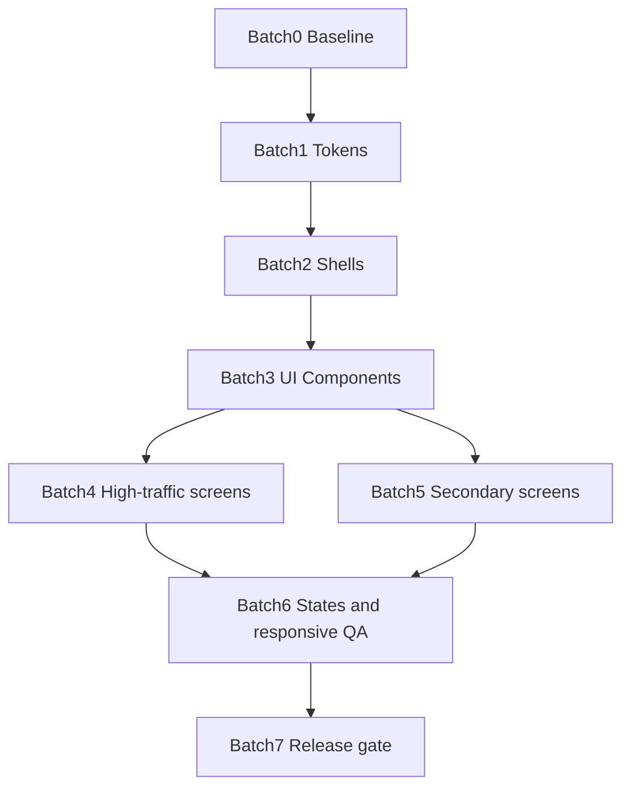

# Figma → Frontend Design Implementation Plan

**Branch:** `migrate/frontend`
**Figma source of truth:** [HyrePath](https://www.figma.com/design/8x0vctnbpqr6WAF7ACyG7I/HyrePath) (`8x0vctnbpqr6WAF7ACyG7I`)
**Plan date:** 2026-09-21
**Scope:** Visual / layout / component migration only — **no** business-logic rewrite, **no** API contract changes unless explicitly flagged below.

---

## 1. Executive Summary

### Goal

Bring the **existing** Next.js frontend in line with the redesigned Figma twin (float sidebar shell, door accents, pastel KPI mosaic, content-parity screens) **without** rebuilding the product. Developers update tokens, shells, shared UI, then screens in batches.

### What is changing

| Layer | Change |
|-------|--------|
| Visual language | Float sidebar shell, sage canvas, forest CTAs, door accents (Candidate / Desk / OSINT), pastel KPI tiles (mint / sky / peach / sand), status chips |
| Layout chrome | `AppSidebar` / `AppShell` spacing, radius, active nav treatment; marketing/auth card layouts |
| Shared components | Button, Badge, Card, Table, Dialog, Tabs, PageHeader, Empty/Skeleton — styled to Figma |
| Screen skins | All ~61 routes restyled to match Figma frames on pages `20–25` |

### What must stay working

- All existing routes under `frontend/app/**`
- Auth (`AuthGuard`, cookies, login/register/verify/invite)
- Staff doors (`StaffGuard` on `/desk`, `/osint`)
- Permission-filtered nav (`nav-config.ts` + `product-doors`)
- React Query / Redux data flows, OpenAPI clients
- Forms, tables, dialogs, impersonation, MFA, mocks (`FRONTEND_USE_MOCKS`)
- E2E smoke / unit tests

### Main risks

1. Shared component restyles cascade across Desk + Candidate + OSINT
2. Float shell vs current flush sidebar breaks responsive / bottom-nav assumptions
3. Figma is desktop-first (1440×900); mobile states incomplete
4. Pastel misuse on primary buttons caused contrast bugs once — must encode `on-primary` rules
5. Parallel agents editing the same shell/components will conflict

### Recommended strategy

1. **Tokens first** → map Figma variables into `globals.css` / Tailwind
2. **Shells second** → Candidate / Desk / OSINT float chrome
3. **Primitives third** → `components/ui/*`
4. **Screens in door batches** → Marketing+Auth → Candidate → Desk → OSINT+Public
5. **QA gate** after each batch (build, lint, smoke, screenshot vs Figma)

---

## 2. Current Frontend Inventory

### Stack

| Item | Detail |
|------|--------|
| Framework | Next.js 15 App Router (`frontend/`) |
| UI | React 18, Tailwind 3, Radix primitives, CVA, Lucide |
| Fonts | IBM Plex Sans / Mono (`app/layout.tsx`) |
| Data | TanStack React Query, Redux Toolkit |
| Toasts | Sonner |
| Tests | Vitest unit, Playwright e2e (`FRONTEND_USE_MOCKS`) |
| Package | [`frontend/package.json`](frontend/package.json) |

### Route structure (61 `page.tsx`)

| Door | Prefix | Layout |
|------|--------|--------|
| Marketing | `/`, `/recruiters`, `/candidates`, `/journalists`, `/investors`, `/sales`, `/opt-out` | [`app/(marketing)/layout.tsx`](frontend/app/(marketing)/layout.tsx) + [`MarketingShell`](frontend/components/layout/MarketingShell.tsx) |
| Auth | `/login`, `/register`, `/verify-email`, `/verify-email-pending`, `/invite/[token]` | [`app/(auth)/layout.tsx`](frontend/app/(auth)/layout.tsx) |
| Candidate | `/app/**` | [`app/app/layout.tsx`](frontend/app/app/layout.tsx) → `AppShell` product=`candidate` |
| Desk | `/desk/**` | [`app/desk/layout.tsx`](frontend/app/desk/layout.tsx) → `StaffGuard` + `AppShell` product=`desk` |
| OSINT | `/osint/**` | [`app/osint/layout.tsx`](frontend/app/osint/layout.tsx) → `StaffGuard` + `AppShell` product=`osint` |
| Public | `/b/[slug]`, `/b/[slug]/[tier]`, `/p/[slug]` | No app shell |

### Major layout shells

| File | Role |
|------|------|
| [`components/layout/AppShell.tsx`](frontend/components/layout/AppShell.tsx) | Authenticated shell: sidebar + nav rail + topbar + bottom nav |
| [`AppSidebar.tsx`](frontend/components/layout/AppSidebar.tsx) | Desktop nav |
| [`AppNavRail.tsx`](frontend/components/layout/AppNavRail.tsx) | Compact rail |
| [`AppTopbar.tsx`](frontend/components/layout/AppTopbar.tsx) | Top chrome |
| [`AppBottomNav.tsx`](frontend/components/layout/AppBottomNav.tsx) | Mobile primary nav |
| [`ShellPage.tsx`](frontend/components/layout/ShellPage.tsx) | Page width / padding |
| [`MarketingShell.tsx`](frontend/components/layout/MarketingShell.tsx) | Public marketing chrome |
| [`nav-config.ts`](frontend/components/layout/nav-config.ts) | Nav sections + permission filters |

### Shared UI components (`components/ui/`)

`button`, `input`, `password-input`, `textarea`, `select`, `checkbox`, `radio-group`, `switch`, `label`, `tabs`, `table`, `card`, `badge`, `dialog`, `sheet`, `alert`, `tooltip`, `skeleton`, `progress`, `separator`, `collapsible`, `filter-bar`, `page-header`, `section-header`, `sonner`, `range-slider`

### Styling system

- CSS variables in [`frontend/app/globals.css`](frontend/app/globals.css) (HSL tokens: primary, surface, success/warning/info/destructive)
- Tailwind maps in [`frontend/tailwind.config.ts`](frontend/tailwind.config.ts)
- Utility classes: `app-surface`, `app-surface-muted`, `app-surface-elevated`
- **Gap vs Figma:** no door accents, pastel mosaic, or float-shell shadow tokens in CSS yet

### State / data fetching

- Feature hooks under `frontend/features/**` (React Query)
- Auth: [`providers/auth-provider.tsx`](frontend/providers/auth-provider.tsx)
- API routes proxy under `frontend/app/api/**`
- Mocks: `FRONTEND_USE_MOCKS` + `src/lib/mocks`

### Auth / permissions

| Guard | File | Used by |
|-------|------|---------|
| `AuthGuard` | [`components/auth/auth-guard.tsx`](frontend/components/auth/auth-guard.tsx) | Candidate app |
| `StaffGuard` | [`components/auth/staff-guard.tsx`](frontend/components/auth/staff-guard.tsx) | Desk + OSINT layouts |
| Product doors | [`src/lib/product-doors.ts`](frontend/src/lib/product-doors.ts) | Nav filtering |
| Verification banner | `components/auth/verification-banner.tsx` | AppShell |
| Impersonation | `features/admin` | AppShell |

### Form / table / modal patterns

- Forms: Radix + Label/Input in feature components (e.g. outreach, MFA, brands)
- Tables: `components/ui/table` + feature tables (`UsersTable`, desk queues)
- Modals: `Dialog` / `Sheet` — Draft outreach, Impersonate, Create brand, Add job, Delete account, MFA disable prompts
- Toasts: Sonner

---

## 3. Figma Design Inventory

**File:** https://www.figma.com/design/8x0vctnbpqr6WAF7ACyG7I/HyrePath

Inspected via Figma MCP (2026-09-21). Status on `00 System`: **pastel-mosaic complete** (content-parity preserved).

### Pages / sections

| Figma page | Contents |
|------------|----------|
| `00 System` | Cover + coverage checklist |
| `10 Foundations` | Color/spacing/radius tokens + pastel/door/status legend |
| `11 Components` | Buttons, chips, KPI mosaic, nav, chart legend |
| `12 Shells` | `Shell / Candidate`, `Shell / Desk`, `Shell / OSINT` |
| `13 Prototype` | Click-through clones (Home → Login → Dashboard → Desk → OSINT → Matches) |
| `20 Marketing` | 7 routes |
| `21 Auth` | 5 routes (white card + pastel side panel) |
| `22 Candidate App` | ~20 routes + dialogs |
| `23 Desk` | ~21 routes + dialogs |
| `24 OSINT` | 5 routes + MFA dialog |
| `25 Public` | 3 routes |
| `90 Archive Twin` | 61 pixel captures of pre-redesign UI (reference only — **do not ship**) |

### Design system tokens (Figma variables)

**Semantic (implement in CSS):**

- Surfaces: `color/bg/page`, `surface`, `soft`, `muted`, `primary`
- Text: `color/text/primary`, `muted`, `on-primary`
- Border: `color/border/default`
- Doors: `color/door/{candidate,desk,osint}` + `-soft`
- Status: `color/status/{success,info,warning,danger}` + `-soft`
- Pastels: `color/pastel/{mint,sky,peach,sand}` + `-deep`
- Charts: `color/chart/1..4`
- Radius: `radius/sm|md|lg|xl`
- Spacing: `spacing/xs` … `2xl`

### Navigation patterns

- Float rounded sidebar on sage page canvas (14px outer padding)
- Door-colored section labels + active soft fill
- Candidate / Desk / OSINT product-specific item lists (mirror `nav-config.ts`)

### Variants / states present in Figma

- Primary / secondary / destructive buttons
- Status chips (Done / Live / Needs review / Failed)
- KPI mosaic strips
- Dialog artboards named `NN /path · Dialog: {name}`
- Empty-state copy on many screens
- Auth: success path + verification failed

### Responsive

- **Assumption:** Figma frames are **desktop 1440×900** only.
- Mobile/tablet: **missing in Figma** — keep existing `AppBottomNav` / breakpoints; do not invent new mobile chrome without design.

### Could not fully inspect

- Exact pixel spacing measurements for every nested auto-layout (use Foundations + shell frames as source)
- Interactive hover/focus variants beyond static fills
- Archive Twin used only as pre-redesign reference

---

## 4. Screen Mapping Table

| Figma Screen | Current Route/File | Match Status | Required Change | Risk Level | Notes |
|--------------|-------------------|--------------|-----------------|------------|-------|
| `20 /` | [`app/page.tsx`](frontend/app/page.tsx) | Route exists but UI needs redesign | Marketing hero + use-case mosaic | Med | Pastel rows |
| `20 /recruiters` | [`(marketing)/recruiters/page.tsx`](frontend/app/(marketing)/recruiters/page.tsx) | Route exists but UI needs redesign | Persona landing skin | Low | |
| `20 /candidates` | [`(marketing)/candidates/page.tsx`](frontend/app/(marketing)/candidates/page.tsx) | Route exists but UI needs redesign | Persona landing skin | Low | |
| `20 /journalists` | [`(marketing)/journalists/page.tsx`](frontend/app/(marketing)/journalists/page.tsx) | Route exists but UI needs redesign | Persona landing skin | Low | |
| `20 /investors` | [`(marketing)/investors/page.tsx`](frontend/app/(marketing)/investors/page.tsx) | Route exists but UI needs redesign | Persona landing skin | Low | |
| `20 /sales` | [`(marketing)/sales/page.tsx`](frontend/app/(marketing)/sales/page.tsx) | Route exists but UI needs redesign | Persona landing skin | Low | |
| `20 /opt-out` | [`opt-out/page.tsx`](frontend/app/opt-out/page.tsx) | Route exists but UI needs redesign | Mode toggles + form skin | Med | Keep form logic |
| `21 /login` | [`(auth)/login/page.tsx`](frontend/app/(auth)/login/page.tsx) | Route exists but UI needs redesign | White card + mint panel | Med | Contrast fixed in Figma |
| `21 /register` | [`(auth)/register/page.tsx`](frontend/app/(auth)/register/page.tsx) | Route exists but UI needs redesign | White card + sky panel | Med | Keep field set |
| `21 /verify-email` | [`(auth)/verify-email/page.tsx`](frontend/app/(auth)/verify-email/page.tsx) | Route exists but UI needs redesign | Failed state card | Low | |
| `21 /verify-email-pending` | [`(auth)/verify-email-pending/page.tsx`](frontend/app/(auth)/verify-email-pending/page.tsx) | Route exists but UI needs redesign | Pending card | Low | |
| `21 /invite/[token]` | [`invite/[token]/page.tsx`](frontend/app/invite/[token]/page.tsx) | Route exists but UI needs redesign | Peach panel + form | Med | |
| `22 /app` | [`app/app/page.tsx`](frontend/app/app/page.tsx) | Route exists but UI needs redesign | Matches hub (same as matches) | Med | Figma treats as Job matches |
| `22 /app/dashboard` | [`app/dashboard/page.tsx`](frontend/app/app/dashboard/page.tsx) | Route exists but UI needs redesign | KPI mosaic + table | Med | |
| `22 /app/matches` | [`app/matches/page.tsx`](frontend/app/app/matches/page.tsx) | Route exists but UI needs redesign | KPI + job cards; **Apply = on-primary** | High | Contrast regression risk |
| `22 /app/matches/swipe` | [`app/matches/swipe/page.tsx`](frontend/app/app/matches/swipe/page.tsx) | Route exists but UI needs redesign | Swipe deck skin | Med | |
| `22 /app/matches/settings` | [`app/matches/settings/page.tsx`](frontend/app/app/matches/settings/page.tsx) | Route exists but UI needs redesign | Preference form | Low | |
| `22 /app/documents` | [`app/documents/page.tsx`](frontend/app/app/documents/page.tsx) | Route exists but UI needs redesign | Upload well + table | High | Dense |
| `22 /app/documents/[documentId]` | [`app/documents/[documentId]/page.tsx`](frontend/app/app/documents/[documentId]/page.tsx) | Route exists but UI needs redesign | Detail + AI feedback | Med | |
| `22 /app/practice` (+ session + report) | `app/practice/**` | Route exists but UI needs redesign | Setup / session / report | Med | |
| `22 /app/tracker` | [`app/tracker/page.tsx`](frontend/app/app/tracker/page.tsx) | Route exists but UI needs redesign | Tracker + Add job dialog | Med | |
| `22 /app/outreach` | [`app/outreach/page.tsx`](frontend/app/app/outreach/page.tsx) | Route exists but UI needs redesign | List + Draft dialog | Med | |
| `22 /app/portfolio` | [`app/portfolio/page.tsx`](frontend/app/app/portfolio/page.tsx) | Route exists but UI needs redesign | Editor skin | Low | |
| `22 /app/settings` (+ security) | `app/settings/**` | Route exists but UI needs redesign | Settings + MFA + delete dialog | Med | |
| `22 /app/privacy` | [`app/privacy/page.tsx`](frontend/app/app/privacy/page.tsx) | Route exists but UI needs redesign | Privacy cards | Low | |
| `22 /app/jobs` (+ `[id]`) | `app/jobs/**` | Route exists but UI needs redesign | Job list/detail | Med | |
| `22 /app/history` | [`app/history/page.tsx`](frontend/app/app/history/page.tsx) | Route exists but UI needs redesign | History table | Low | |
| `22 /app/health` | [`app/health/page.tsx`](frontend/app/app/health/page.tsx) | Route exists but UI needs redesign | Health cards | Low | |
| `23 /desk` | [`desk/page.tsx`](frontend/app/desk/page.tsx) | Route exists but UI needs redesign | Ops home KPIs | Med | |
| `23 /desk/system-health` | [`desk/system-health/page.tsx`](frontend/app/desk/system-health/page.tsx) | Route exists but UI needs redesign | Health panels | Med | |
| `23 /desk/sourcing-leads` | [`desk/sourcing-leads/page.tsx`](frontend/app/desk/sourcing-leads/page.tsx) | Route exists but UI needs redesign | Lead form + table | High | Unique form |
| `23 /desk/linkedin-tasks` | [`desk/linkedin-tasks/page.tsx`](frontend/app/desk/linkedin-tasks/page.tsx) | Route exists but UI needs redesign | Tasks + Create batch dialog | Med | |
| `23 /desk/brands` | [`desk/brands/page.tsx`](frontend/app/desk/brands/page.tsx) | Route exists but UI needs redesign | Brands + Create dialog | Med | |
| `23 /desk/roles` | [`desk/roles/page.tsx`](frontend/app/desk/roles/page.tsx) | Route exists but UI needs redesign | Roles matrix | Med | |
| `23 /desk/staff-invites` | [`desk/staff-invites/page.tsx`](frontend/app/desk/staff-invites/page.tsx) | Route exists but UI needs redesign | Invites table | Low | |
| `23 /desk/feature-flags` | [`desk/feature-flags/page.tsx`](frontend/app/desk/feature-flags/page.tsx) | Route exists but UI needs redesign | Flags table | Low | |
| `23 /desk/analytics` | [`desk/analytics/page.tsx`](frontend/app/desk/analytics/page.tsx) | Route exists but UI needs redesign | KPI mosaic + chart legend | Med | |
| `23 /desk/demand-intelligence` | [`desk/demand-intelligence/page.tsx`](frontend/app/desk/demand-intelligence/page.tsx) | Route exists but UI needs redesign | Demand panels | Med | |
| `23 /desk/signals` | [`desk/signals/page.tsx`](frontend/app/desk/signals/page.tsx) | Route exists but UI needs redesign | Signals queue | Med | |
| `23 /desk/queues` | [`desk/queues/page.tsx`](frontend/app/desk/queues/page.tsx) | Route exists but UI needs redesign | Queue table | Med | |
| `23 /desk/users` (+ detail) | `desk/users/**` | Route exists but UI needs redesign | Users + Impersonate dialog | High | Permissions |
| `23 /desk/audit-logs` | [`desk/audit-logs/page.tsx`](frontend/app/desk/audit-logs/page.tsx) | Route exists but UI needs redesign | Audit table | Low | |
| `23 /desk/review-queue` | [`desk/review-queue/page.tsx`](frontend/app/desk/review-queue/page.tsx) | Route exists but UI needs redesign | Review + decision dialog | High | |
| `23 /desk/job-postings` | [`desk/job-postings/page.tsx`](frontend/app/desk/job-postings/page.tsx) | Route exists but UI needs redesign | Postings + hide reason dialog | Med | |
| `23 /desk/documents` | [`desk/documents/page.tsx`](frontend/app/desk/documents/page.tsx) | Route exists but UI needs redesign | Moderation table | Med | |
| `23 /desk/portfolio` | [`desk/portfolio/page.tsx`](frontend/app/desk/portfolio/page.tsx) | Route exists but UI needs redesign | Portfolio moderation | Low | |
| `23 /desk/outreach` | [`desk/outreach/page.tsx`](frontend/app/desk/outreach/page.tsx) | Route exists but UI needs redesign | Outreach moderation | Low | |
| `23 /desk/ai-actions` | [`desk/ai-actions/page.tsx`](frontend/app/desk/ai-actions/page.tsx) | Route exists but UI needs redesign | AI actions table | Low | |
| `24 /osint` | [`osint/page.tsx`](frontend/app/osint/page.tsx) | Route exists but UI needs redesign | Full intake UI | High | Densest |
| `24 /osint/jobs` (+ `[id]`) | `osint/jobs/**` | Route exists but UI needs redesign | History + dossier | High | |
| `24 /osint/settings` (+ security) | `osint/settings/**` | Route exists but UI needs redesign | Settings + MFA | Med | |
| `25 /b/[slug]` (+ tier) | `b/[slug]/**` | Route exists but UI needs redesign | Brand landing skin | Low | CMS-dependent |
| `25 /p/[slug]` | [`p/[slug]/page.tsx`](frontend/app/p/[slug]/page.tsx) | Route exists but UI needs redesign | Public portfolio | Low | |
| Dialog frames (10+) | Feature dialogs in `features/**` | Partial match | Restyle dialog chrome only | Med | Keep behavior |
| — | API routes `app/api/**` | Exists in frontend but missing in Figma | **No visual work** | — | Out of scope |
| — | Middleware / subdomain | Exists in frontend but missing in Figma | **No visual work** | — | |
| Hover/focus/mobile sheets | — | Missing in Figma | Keep current behavior; clarify | Med | See §11 |

**Summary:** ~61 Figma route frames ↔ 61 frontend pages — **no missing routes**. Work is **UI redesign**, not greenfield screens.

---

## 5. Shared Design System Plan

| Item | Existing | Figma ref | Required change | Blocks screens? |
|------|----------|-----------|-----------------|-----------------|
| Typography | IBM Plex in layout; Inter in Figma | Foundations | Prefer **keep IBM Plex in app** (brand); match sizes/weights from Figma | Soft block |
| Spacing | Tailwind defaults + ad hoc | `spacing/*` | Document 4/8/12/16/24 scale; use in shells | Yes |
| Colors | `globals.css` sage/forest | Door + pastel + status | Add CSS vars for door/pastel/status-soft; map Tailwind | **Yes** |
| Radius | `--radius: 0.875rem` | `radius/md|lg|xl` | Align shell `rounded-2xl`, cards `rounded-xl` | Yes |
| Shadows | `shadow-panel` | Float shell shadow | Add float-sidebar shadow token | Yes |
| Buttons | [`ui/button.tsx`](frontend/components/ui/button.tsx) | Components | Ensure primary → `primary-foreground`; destructive; outline | **Yes** |
| Inputs | [`ui/input.tsx`](frontend/components/ui/input.tsx) | Auth/forms | Soft border, page fill | Yes |
| Selects / checkbox / radio | `ui/*` | Forms | Visual only | Soft |
| Tabs | [`ui/tabs.tsx`](frontend/components/ui/tabs.tsx) | Active door-soft | Active = door/primary-soft | Yes |
| Tables | [`ui/table.tsx`](frontend/components/ui/table.tsx) | Desk tables | Header text door accent; row hover | Yes |
| Cards | [`ui/card.tsx`](frontend/components/ui/card.tsx) | KPI mosaic | Optional `variant="pastel-{mint|sky|peach|sand}"` | Yes |
| Badges | [`ui/badge.tsx`](frontend/components/ui/badge.tsx) | Status chips | Status soft/solid variants | Yes |
| Modals | [`ui/dialog.tsx`](frontend/components/ui/dialog.tsx) | Dialog artboards | Surface card; danger CTAs | Soft |
| Toasts | Sonner | — | Keep; match primary colors | No |
| Empty / loading | Skeleton + ad hoc copy | Empty copy in frames | Shared `EmptyState` if missing | Soft |
| Page headers | [`ui/page-header.tsx`](frontend/components/ui/page-header.tsx) | H1 patterns | Match Figma title/description | Soft |
| Sidebar / nav | `AppSidebar` etc. | `12 Shells` | **Float shell** — largest shell change | **Yes** |
| Containers | `ShellPage` | Main surface card | Outer page padding + rounded Main | **Yes** |

**Hard rule for agents:** Never put pastel-deep / ink text on `bg-primary` or `bg-destructive`. Use `text-primary-foreground`.

---

## 6. Implementation Batches

### Batch 0 — Safety and Baseline

**Purpose:** Confirm app runs; capture before state.

**Deliverables:**

- [ ] `FRONTEND_USE_MOCKS=true npm run dev` healthy on `:3000`
- [ ] Route inventory (this plan §2 / §4) checked into branch
- [ ] Screenshot baseline folder (local/gitignored or CI artifact): `/`, `/login`, `/app/matches`, `/desk`, `/osint`, `/app/documents`
- [ ] `npm run lint` + `npm run typecheck` + `npm run test:unit` green on branch tip
- [ ] Known-risk list (§9) acknowledged by implementers

**Owner:** Agent G (QA) + Agent H (integrator)

---

### Batch 1 — Design Tokens and Global Styling

**Purpose:** Land Figma tokens in CSS/Tailwind without changing layouts yet.

**Files:**

- [`frontend/app/globals.css`](frontend/app/globals.css)
- [`frontend/tailwind.config.ts`](frontend/tailwind.config.ts)

**Deliverables:**

- [ ] Door, status-soft, pastel, chart CSS variables
- [ ] Tailwind color keys (`door-candidate`, `pastel-mint`, etc.)
- [ ] Shadow token for float sidebar
- [ ] Story/demo optional: temporary `/dev/tokens` **not required** — Components page in Figma is enough
- [ ] Document token ↔ Figma variable mapping in PR description

**Do not:** Change `AppShell` structure in this batch.

---

### Batch 2 — Layout Shells

**Purpose:** Float shell + door nav before screens.

**Files:**

- [`AppShell.tsx`](frontend/components/layout/AppShell.tsx)
- [`AppSidebar.tsx`](frontend/components/layout/AppSidebar.tsx)
- [`AppNavRail.tsx`](frontend/components/layout/AppNavRail.tsx)
- [`AppTopbar.tsx`](frontend/components/layout/AppTopbar.tsx)
- [`ShellPage.tsx`](frontend/components/layout/ShellPage.tsx)
- [`MarketingShell.tsx`](frontend/components/layout/MarketingShell.tsx)
- [`(auth)/layout.tsx`](frontend/app/(auth)/layout.tsx)

**Deliverables:**

- [ ] Page canvas = `bg-background` with outer padding; sidebar float + shadow
- [ ] Main = rounded surface card
- [ ] Active nav = door-soft + door text (product-specific)
- [ ] Auth layout = centered white card + optional pastel side panel (match Figma `21 Auth`)
- [ ] Preserve `StaffGuard` / `AuthGuard` / bottom nav behavior
- [ ] Unit tests for shell still pass (`AppShell.test.tsx`, etc.)

**Figma refs:** `12 Shells`, `21 Auth`

---

### Batch 3 — Core Reusable Components

**Purpose:** Update primitives used everywhere.

**Files:** `frontend/components/ui/*` (button, badge, card, table, tabs, dialog, input, page-header, skeleton)

**Deliverables:**

- [ ] Button contrast lock (primary/destructive)
- [ ] Badge status variants
- [ ] Card pastel variants **or** utility classes `bg-pastel-mint` etc.
- [ ] Table header styling
- [ ] Tabs active state
- [ ] Dialog surface + footer actions
- [ ] Component unit tests updated for classNames only

**Do not:** Edit feature business logic under `features/**` except className props.

---

### Batch 4 — High-Traffic Screens

| Screen | Files (entry) | Risk |
|--------|---------------|------|
| Marketing `/` | `app/page.tsx`, `features/marketing/**` | Med |
| Auth login/register/invite | `app/(auth)/**`, `app/invite/**` | Med |
| Candidate matches / `/app` | `app/app/page.tsx`, `app/matches/**`, `features/job-matching/**`, `features/job-swipe/**` | **High** |
| Documents | `app/documents/**`, `features/documents/**`, `features/cv-management/**` | **High** |
| Dashboard | `app/dashboard/**`, `features/dashboard/**` | Med |
| OSINT intake | `app/osint/page.tsx`, `features/enrich/**` / dossier | **High** |
| Desk home + users + review-queue | `app/desk/**`, `features/admin/**` | **High** |

**Deliverables:** Visual parity with Figma frames; behavior unchanged; Apply/CTA contrast verified.

---

### Batch 5 — Secondary Screens

- Remaining Candidate: practice, tracker, outreach, portfolio, settings, privacy, jobs, history, health
- Remaining Desk: brands, sourcing-leads, linkedin-tasks, roles, invites, flags, analytics, demand, signals, queues, audit, job-postings, documents, portfolio, outreach, ai-actions, system-health
- OSINT jobs/detail/settings
- Public `/b/*`, `/p/*`
- Marketing personas + opt-out

**Deliverables:** Same as Batch 4 for lower-traffic routes.

---

### Batch 6 — Edge States and Responsive QA

**Deliverables:**

- [ ] Empty / loading / error checklist per high-traffic screen
- [ ] Permission: candidate cannot open `/desk`; staff can
- [ ] MFA / impersonation dialogs still function
- [ ] Mobile: bottom nav still usable after float shell
- [ ] Visual bug list filed

---

### Batch 7 — Final Integration and Release Gate

**Deliverables:**

- [ ] Screenshot comparison vs Figma `20–25` (desktop)
- [ ] `lint` / `typecheck` / `test:unit` / `test:smoke`
- [ ] Remaining gap list (mobile, hover)
- [ ] Release recommendation (merge `migrate/frontend` → `main` when gate green)

---

## 7. Parallel Agent Assignment Plan

| Agent | Scope | Owns | Must not touch | Inputs | Output | DoD |
|-------|-------|------|----------------|--------|--------|-----|
| **A — Mapper** | Keep mapping current | This plan updates | App code | Figma + routes | Mapping PR comments | §4 accurate |
| **B — Tokens** | Batch 1 | `globals.css`, `tailwind.config.ts` | Shells/screens | Figma Foundations | Token PR | Tokens usable in Tailwind |
| **C — Shells** | Batch 2 | `components/layout/**`, auth/marketing layouts | Feature pages | Tokens merged | Shell PR | Float shell on all doors |
| **D — Components** | Batch 3 | `components/ui/**` | Features | Tokens merged | UI PR | Contrast tests / visual check |
| **E — Screens G1** | Batch 4 Marketing+Auth+Candidate dense | `(marketing)`, `(auth)`, `app/app/**` matches/docs/dashboard | Desk/OSINT | Shells+UI merged | Screen PRs | Figma parity + smoke |
| **F — Screens G2** | Batch 4–5 Desk+OSINT+Public | `app/desk/**`, `app/osint/**`, `b/**`, `p/**` | Candidate features | Shells+UI merged | Screen PRs | Figma parity + staff smoke |
| **G — QA** | Batches 0, 6, 7 | e2e / screenshots | Product logic | All PRs | Bug list + gate | Smoke green |
| **H — Integrator** | Sequencing / conflicts | Merge order | Drive-by refactors | All agents | Integration PR | Release gate |

**Conflict rule:** Only **one** agent edits `AppShell` / `globals.css` / `button.tsx` at a time (B → C → D sequence). E and F may run in parallel after D merges.

---

## 8. Screen-by-Screen Implementation Checklist

Use this template per screen (agents copy into PR):

```text
- Route:
- Current files:
- Figma frame: (e.g. 22 /app/matches)
- Components used:
- API/data dependencies: (hooks — do not change)
- Auth/permission dependencies:
- Required UI changes:
- Required responsive changes: (desktop first; preserve mobile nav)
- Loading state:
- Empty state:
- Error state:
- Form validation: (unchanged unless Figma adds fields — flag §11)
- Risk level: Low | Med | High
- QA checklist: [ ] screenshot [ ] primary CTA contrast [ ] nav active [ ] empty copy
- Owner: Agent E | F
- Status: todo | in_progress | done
```

### Priority checklist seeds (High)

#### `/app/matches` (+ `/app`)

- Route: `/app/matches`, `/app`
- Files: `app/app/matches/page.tsx`, `app/app/page.tsx`, `features/job-matching/**`, `features/job-swipe/**`
- Figma: `22 /app/matches`, `22 /app`
- UI: KPI mosaic, job cards, **Apply = bg-primary + text-primary-foreground**
- Risk: **High**
- Owner: E

#### `/app/documents`

- Route: `/app/documents`
- Files: `app/app/documents/**`, `features/documents/**`, `features/cv-management/**`
- Figma: `22 /app/documents`
- UI: Upload well pastel, tabs, table headers
- Risk: **High**
- Owner: E

#### `/osint`

- Route: `/osint`
- Files: `app/osint/page.tsx`, enrich/dossier features
- Figma: `24 /osint`
- UI: Mode/tier controls, fields, queues, KPI mosaic — **no field removal**
- Risk: **High**
- Owner: F

#### `/desk/users`, `/desk/review-queue`

- Routes: `/desk/users`, `/desk/review-queue`
- Files: `features/admin/**`
- Figma: `23 /desk/users`, `23 /desk/review-queue` + dialogs
- UI: Table + Impersonate / Review dialogs
- Risk: **High**
- Owner: F

*(Remaining screens follow the same template using §4 mapping — agents fill during Batch 4–5.)*

---

## 9. Risk Register

| Risk | Area | Impact | Likelihood | Mitigation | Owner |
|------|------|--------|------------|------------|-------|
| Many screens at once | Process | High | High | Batches + parallel only after shells | H |
| Shared component break | `ui/*` | High | Med | Snapshot tests; small PRs; contrast checklist | D, G |
| Figma missing mobile | Responsive | Med | High | Preserve bottom nav; no invented mobile chrome | C, G |
| Figma missing hover/focus | A11y | Med | Med | Keep Radix focus rings | D |
| Pastel on primary CTA | Contrast | High | Med | Lint rule / PR checklist; button API | D, E |
| Permission UI break | Desk/OSINT | High | Low | StaffGuard untouched; e2e desk smoke | F, G |
| Table/form regression | Desk | High | Med | Behavior-only className diffs | F |
| Agent conflicts on shell | Git | Med | High | Serialize B→C→D | H |
| API assumptions in UI | Features | Med | Low | No API changes without ADR | H |
| Auth layout break | Auth | Med | Med | Keep form fields; skin only | E |

---

## 10. QA and Review Plan

### Automated

- [ ] `npm run lint`
- [ ] `npm run typecheck`
- [ ] `npm run test:unit`
- [ ] `npm run test:smoke` (Playwright mocks)
- [ ] Desk/OSINT smoke with temporary superuser mock **only in local QA**, revert after

### Manual (per batch)

- [ ] Route loads 200
- [ ] Screenshot vs Figma frame (desktop)
- [ ] Primary / destructive CTA readable
- [ ] Active nav door color correct
- [ ] Forms still submit
- [ ] Dialogs open/close
- [ ] Empty / loading visible where applicable

### Accessibility basics

- [ ] Focus visible on inputs/buttons
- [ ] Contrast ≥ WCAG AA for text on pastel and primary
- [ ] Dialogs trap focus (Radix)

### Release gate

- [ ] Batches 1–5 complete or explicitly deferred
- [ ] No open High bugs
- [ ] Smoke + unit green
- [ ] `MOCK_USER.is_superuser` is `false` on mainline
- [ ] Integrator sign-off

---

## 11. Clarification Questions for Design/Product

### Missing screens / states

1. Are **mobile** shells intended to match float desktop, or keep current bottom-nav-only pattern?
2. Do we need dedicated Figma frames for **loading skeletons** and **API error** toasts?

### Conflicting layouts

3. Figma uses **Inter**; app uses **IBM Plex** — confirm keep Plex in production.
4. `/app` and `/app/matches` both show Job matches in Figma — should `/app` redirect to `/matches` long-term, or stay duplicate hub? (**Assumption:** keep both routes; shared visual.)

### Responsive

5. Tablet breakpoint for float sidebar collapse — keep `lg` as today?

### Component behavior

6. Pastel KPI cycling — fixed order mint→sky→peach→sand, or meaning-based (Failed always danger)? (**Assumption:** meaning wins for Failed/Blocked; else cycle.)

### Data / API

7. Any Figma field on OSINT/Desk **not** in current forms? (**Assumption:** content-parity already matched — no new fields.)

### Auth / permissions

8. Should non-staff seeing Desk nav items ever appear in Figma? (**Assumption:** no — permission filter stays.)

*Unanswered items do not block Batches 0–3.*

---

## 12. Final Execution Order



| Step | Sequential? | Parallel? |
|------|-------------|-----------|
| 1. Inventory / mapping | Done (this doc) | A maintains |
| 2. Tokens | After 0 | Alone |
| 3. Shells | After tokens | Alone |
| 4. Shared components | After shells | Alone |
| 5. Screen batches | After components | **E ∥ F** by door |
| 6. Responsive / state QA | After screens | G |
| 7. Integration review | Last | H |

### Must be sequential

Tokens → Shells → Core UI components

### Can be parallel

- Candidate screens (E) ∥ Desk/OSINT/Public screens (F) after Batch 3
- QA smoke can run continuously after Batch 2

---

## Assumptions (explicit)

1. Figma file `8x0vctnbpqr6WAF7ACyG7I` is the visual source of truth for this migration.
2. `90 Archive Twin` is reference only — not a shipping target.
3. No API / OpenAPI / backend changes in this program.
4. IBM Plex remains the production font unless Product overrides §11.3.
5. Content-parity field inventory already matches product — migration is **skin + layout**, not new features.
6. Desktop-first; mobile keeps existing patterns until design delivers frames.

---

## Out of scope

- Rewriting feature business logic
- Implementing float shell as a separate product
- Dark mode
- Deleting routes or Archive Twin
- Changing permission models

---

*End of plan. Implementation starts only after Batch 0 baseline is confirmed on branch `migrate/frontend`.*
