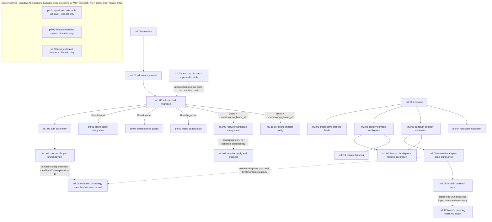

# Task Orchestration — Placement-Agency Platform

Planning docs for pivoting HyrePath from a single-tenant candidate-enrichment backend into a
**single-operator, multi-brand placement platform**: one internal team works one shared pool of
candidates and recruiters, presented to the outside world through multiple branded storefronts
(`Brand`). A `Brand` is a marketing/presentation concept only — name, slug, optional custom
domain, chatbot config, landing-page tier config — **never** a data-isolation boundary. There is
no per-agency tenant, no `org_id` access-scoping column or JWT claim anywhere in this design, and
any recruiter can search, view, and act on any candidate in the shared pool regardless of which
brand storefront that candidate signed up through.

This directory is **documentation only**. No application code is changed by these files
themselves; each `.md` is a self-contained spec for a later implementation PR.

Base branch for this planning work: `master-complete-foundation` (HEAD at time of writing:
`142b3756`, "Merge pull request #248 ... admin-module3-4-cors-ratelimit"). Working branch:
`feat/placement-agency-platform`.

## Why this structure

Two machines/agents work in parallel from day one:

- **Machine 1** owns `machine-1-tenancy-core/` — the foundational, blocking work: what a
  `Brand` is, how it's stored, how CORS/presentation resolve per brand. Every chunk elsewhere in
  this doc set that reads `Brand`/`users.signup_brand_id`/`recruiter_candidate_assignments`
  eventually depends on this landing, so it is deliberately small and merges first. Unlike the
  original isolated-tenant design, this track adds **no access-control mechanism at all** — no
  `org_id` column, no JWT claim, no query filter — so it hands off no "add a WHERE clause" wave
  to anything downstream.
- **Machine 2** owns `machine-2-parallel-tracks/` — twelve independent feature tracks that do
  **not** touch brand/tenant scoping (because there is none to touch) and do not depend on
  `machine-1` landing first except where a specific chunk's own "Depends on" section says
  otherwise (see the dependency graph below). They can be built, reviewed, and merged largely in
  any order, concurrently with `machine-1`.

Once `machine-1-tenancy-core` merges to `master-complete-foundation`, only one further wave
remains:

- **`post-tenancy-features/`** — net-new features that build on the `Brand` model once it exists:
  candidate-level billing (freemium paywall) and brand landing/tier pages. There is no
  `post-tenancy-retrofit/` wave in this doc set — that wave existed only under the old
  isolated-agency-tenant model to backfill `org_id` scoping into pre-existing queries; since
  `Brand` never gates data access, there is nothing for such a wave to retrofit, and it has been
  deleted outright. There is also no "hard gate" of any kind blocking these features — they only
  need `Brand` to exist as a table, not a passing isolation-test suite (none exists, none is
  needed).

## Dependency graph

**`SIDE` (the three `post-tenancy-features/04, 05, 06` chunks) is deliberately drawn with zero
edges into or out of the rest of this graph.** These three are new, separate initiatives added on
2026-08-25 (see "Confirmed by leadership" entries and "Open questions" below) — idea lists only,
not implementation-ready chunks, not mixed into the main Machine 1/Machine 2 merge order at all.
`04` and `05` are hard-blocked on a conversation with Abhishek (multiagentic-system integration)
that has not happened yet; `06` is blocked on a dedicated MCP-server-availability research pass.
None of the three should be dispatched to a developer subagent until their respective blocker is
cleared and a real chunk spec exists — see each file's own header for detail.

`machine-2-*` nodes have **no edges into `machine-1-*`** except where a chunk's own file states a
real schema dependency — `08-recruiter-candidate-assignment.md` and
`11-per-brand-chatbot-config.md` are the two genuine exceptions, since both read columns/tables
`machine-1/02` creates (`users.signup_brand_id`, and the design premise that
`recruiter_candidate_assignments` is an ownership marker on a single shared pool). Every other
machine-2 chunk, including `04-rbac-admin-platform.md`, needs nothing from `machine-1` to land
first: `04` extends the *existing* `roles`/`permissions` tables (already shipped, ADR 0015) with
this platform's own internal-team role rows (`team_owner`, `recruiter`) — it does not require
`Brand` or any brand/org column to exist to insert a `Role` row, and — unlike the old
`agency_owner`/`agency_recruiter` design — it never becomes tenant-aware later, because there is
no tenant to become aware of.

`03-auth-org-id-claim.md` is drawn as a dashed, non-blocking edge because it is a **superseded
stub, not active work**: its original scope (an `org_id` JWT claim, an `OrgScopedUser` dependency)
is not implemented. It is kept as a file, not deleted, only because other files in this doc set
still reference it by name; it produces no code and sits on no critical path. The implementation
order that matters within `machine-1` is **`01 → 02 → 05 → 04`** — `03` is irrelevant to that
order.

`M2_07`'s two incoming edges (`M2_02 --> M2_07`, `M2_03 --> M2_07`) mirror that chunk's own
"Depends on" section exactly: it needs `M2_02`'s `get_top_countries_for_role()` function and
`M2_03`'s established LLM prompt-construction append-pattern (`_STRATEGY_INSTRUCTIONS`'s
composition style) as the convention its own prompt-context addition follows. Per that chunk's
own ground-truth note, its actual data dependency (`desired_roles` on `CVData`) already exists
independent of `machine-2-parallel-tracks/01-progressive-profiling-fields.md`, so there is
deliberately **no** `M2_01 --> M2_07` edge.

`M2_09`'s edge to `M2_08` is drawn dashed/conceptual because `09`'s own file is explicit that its
authorization does **not** check `RecruiterCandidateAssignment` at all — any recruiter may
apply/suggest on behalf of any candidate, consistent with `08`'s "assignment is not an access
gate" decision. The two chunks are thematically related (both are recruiter-on-behalf-of-candidate
actions) but have no structural/import dependency; `09` can be implemented and merged before,
after, or in parallel with `08`.

`M2_12`'s edge to `M2_06` is drawn dashed for the same reason: `12` (sourcing/scouting leads) is
explicitly **not** wired into `06`'s (send task-queue) tables — a `SourcedCandidateLead` is an
*input* a recruiter may later choose to act on via `06`'s existing flow, using the lead's
`linkedin_profile_url`, but no code in `12` calls into or depends on `06`'s modules, and no code
in `06` depends on `12`. Both chunks also carry their own prominent, independent legal-risk
sections (see "LinkedIn legal-risk chunks" below) — read both before implementing either.

`M2_02 --> M2_10` is a new edge (added alongside chunk `M1_06`, below): `10-resume-tailoring.md`'s
"Demand-intelligence context injection" section reads `M2_02`'s `get_top_countries_for_role()`,
closing a dangling promise `02-country-demand-intelligence.md` had made (its own "future consumer"
note named `10` without `10` ever actually depending on `02`). This mirrors the existing
`M2_02 --> M2_07` edge exactly — same function, same read-only import, same flag-gated/additive
contract — applied to the resume-tailoring prompt instead of the outreach-drafting prompt.

`M1_06` (`machine-1-tenancy-core/06-outbound-ip-strategy-resolved.md`) is a chunk resolving an
explicit decision: the "multiple outbound IPs" ambiguity from the original task brief. Its two
dashed incoming edges are citation-only, not code dependencies — it reads `M2_05`'s "no real
outreach-sending infrastructure exists yet" ground truth (for its interpretation (A), now
resolved as Multilogin per-account IP diversity, already covered by
`machine-2-parallel-tracks/12-linkedin-sourcing-intern-multilogin.md`) and `M1_04`'s
`Brand.custom_domain`/CORS-resolution design (for its interpretation (B), per-brand hosting
isolation — confirmed as wanted by leadership on 2026-08-24/25, but genuinely underspecified
relative to `M1_04`'s existing shared-backend design; see that file and this README's "Open
questions blocking further work" section, item 8). `M1_06` produces no code and blocks nothing
else in this doc set — it exists purely so a future reader finds a reasoned resolution record
instead of silence, and so the still-open "what does separate hosting per brand actually mean"
question is tracked explicitly rather than assumed either way.

`PTF_03` (brand deactivation) has **no edge to `PTF_01`** (billing) — this is a deliberate
absence, not an oversight. The prior "org offboarding" design depended on billing for
Stripe-customer-redaction sequencing because deleting an *organization* cascaded through its
owned users' financial records. Deactivating a `Brand` cascades through nothing (a brand never
owned candidates), so there is no billing interaction to sequence against at all.

## Merge order

**Note (2026-08-26):** the risk noted in the old "Open questions" item 1 — that Machine 1's
tenancy model might need reworking depending on how James's interface #1 was meant — is resolved
(see "Confirmed by leadership," item 7). Machine 1 was never actually gated on that answer in the
step-by-step order below (its own chunks proceeded on the `Brand`-is-presentation-only premise
regardless), but the *risk* of a retroactive rework hung over the whole track until now. It does
not; step 3 below stands as originally speced, with no rework and no new blocker.

1. **Anytime, any order, fully parallel:** `machine-2-parallel-tracks/01`, `02`, `04`, and `08`
   may be implemented and merged to `master-complete-foundation` independently of everything else
   in this document (each touches disjoint files — see each file's "Do not touch" list). Two soft
   ordering preferences, neither a hard block: `07` (demand-intelligence resume integration) reuses
   `02`'s read function and `03`'s prompt-append convention, so implement `07` after both; `09`
   (recruiter apply/suggest) is conceptually related to `08` but has no structural dependency on
   it, so it may land in any order relative to `08`.
2. **Sequential sub-chain, parallel to everything else in step 1:** `03 → 05 → 06`
   (outreach strategy dimension → CAN-SPAM compliance → LinkedIn send) — each later chunk imports
   the previous chunk's schema/service additions, so these three are one branch or three stacked
   branches, implemented and reviewed in that order.
3. **Must merge before any chunk that reads `Brand`/`users.signup_brand_id` (namely
   `machine-2-parallel-tracks/08`, `11`, and all of `post-tenancy-features/`):**
   `machine-1-tenancy-core`, in its internal chunk order **`01 → 02 → 05 → 04`**. `03` is a
   superseded stub and is not part of this sequential chain — it can be left exactly as-is,
   merged or not, with zero effect on anything else in this doc set. Chunk `05` (staff invite
   flow) sits directly after `02` and before `04` — `05` needs `02`'s schema to exist (its
   `invited_by`/role-assignment plumbing) but has no dependency on `04`'s CORS retrofit at all, and
   placing invite-creation ahead of the CORS retrofit is the more sensible product-readiness
   order (staff can be invited before the per-brand-domain CORS allow-list is wired up). This is
   one branch, `feat/tenancy-core`, reviewed as up to four stacked PRs (or one PR, implementer's
   choice) covering `01`, `02`, `05`, `04` — `03` needs no PR at all since it is a no-op stub.
   **Note:** `08` and `11` do not strictly need to *wait* for this step if their own migrations
   target the real current Alembic head instead of assuming `machine-1/02`'s specific revision —
   but neither can be considered functionally complete (their own FK/column reads will fail) until
   `machine-1/02`'s schema is actually present, so treat this as a soft-but-strong ordering
   preference for `08`/`11` specifically, distinct from the hard block on `post-tenancy-features/*`
   below.
4. **After `machine-1-tenancy-core` merges:** `post-tenancy-features/01` (billing), `02` (brand
   landing pages), and `03` (brand deactivation) may branch and merge in any order relative to
   each other — unlike the pre-pivot design, `03` has **no** dependency on `01` (deactivation has
   no billing interaction at all, since billing is candidate-level, not brand-level; see the
   dependency-graph note above). There is no isolation-test hard gate of any kind blocking this
   step — that gate existed only for the now-deleted `post-tenancy-retrofit/` wave.
5. **Independent of every step above, at any time:** `machine-2-parallel-tracks/10` (resume
   tailoring) and `12` (LinkedIn sourcing) have no schema/migration dependency on any other chunk
   in this doc set (`10` adds no migration at all — its own "Demand-intelligence context
   injection" section only reads `M2_02`'s existing read function, no schema coupling; `12`
   depends only on the existing RBAC `require_permission` mechanism, seeding its own permission
   row directly if `04` hasn't landed yet). Both may be dispatched and merged whenever convenient.
   `machine-1-tenancy-core/06-outbound-ip-strategy-resolved.md` is also independent of the `01 →
   02 → 05 → 04` chain and of every other chunk's merge status — it is a documentation-only
   decision record with no code and no schema, so it can be merged at any time and blocks nothing.
6. **Not part of this merge order at all, and not to be treated as ready for any of the steps
   above:** `post-tenancy-features/04, 05, 06` (the "Side initiatives" grouping — see the
   dependency graph's `SIDE` subgraph note). These three are idea-list-only documents, each
   explicitly blocked on either the Abhishek/multiagentic-system conversation (`04`, `05`) or a
   dedicated MCP-server-availability research pass (`06`), neither of which has happened as of
   2026-08-25. Do not dispatch a developer subagent to any of the three, and do not fold them into
   step 1-5's ordering, until their blocker clears and a real implementation-ready chunk spec is
   written as a follow-up to these idea-list files.

## LinkedIn legal-risk chunks

Two chunks in this doc set — `machine-2-parallel-tracks/06-linkedin-outreach-send.md` (outbound
send) and `machine-2-parallel-tracks/12-linkedin-sourcing-intern-multilogin.md` (inbound
sourcing/scouting) — each carry their own prominent, independently-required legal-risk section at
the top of the file. Both are deliberately human-in-the-loop, not automated: `06` is a task queue
where a human operator performs the actual LinkedIn send in their own session; `12` is a manual
data-entry form where an intern types in what they personally observed on a profile, with zero
programmatic reads of linkedin.com anywhere in the design. `12`'s fact pattern is, if anything,
closer to the actual `hiQ Labs v. LinkedIn` judgment (data scraping) than `06`'s is — read both
risk sections before implementing either, and do not treat either file's "human-in-the-loop"
framing as decoration; it is the load-bearing legal-risk mitigation for both chunks.

## Subagent role assignment

| Track | Developer | Reviewer | Tester | Notes |
|---|---|---|---|---|
| `machine-1-tenancy-core` (`01`, `02`, `05`, `04`) | 1 developer subagent, sequential dispatch (chunk N waits for chunk N-1's schema to exist; order is `01→02→05→04`) | 1 reviewer subagent per chunk, gates progression to next chunk | 1 tester subagent after chunk `04`, full CORS+invite-flow test pass | `03` is a superseded stub — no subagent dispatch of any kind; it is not implemented |
| `machine-1-tenancy-core/06` | No developer subagent — this chunk is a decision record, not code; the file itself is the deliverable | 1 reviewer subagent confirms the file is linked from this README's dependency graph/gap-tracking section and that no other chunk contradicts its resolution | No tester subagent — nothing to test, see this chunk's own "Verification" (a documentation checklist) | Independent of the `01→02→05→04` chain; may be dispatched/merged whenever convenient (see "Merge order" §5) |
| `machine-2-parallel-tracks/01, 02, 04, 08` | 1 developer subagent per track, dispatched in parallel | 1 reviewer subagent per track | 1 tester subagent per track | Independent CV/profiling, JobSpy-country, RBAC, and recruiter-assignment domains, zero file overlap |
| `machine-2-parallel-tracks/03 → 05 → 06` | 1 developer subagent, sequential within this sub-chain (`06` imports the schema `03` defines and the compliance primitives `05` defines) | 1 reviewer subagent per chunk — `06`'s reviewer must also confirm the human-in-the-loop design boundary (no LinkedIn network call/browser automation anywhere in the diff) | 1 tester subagent after `06` | This sub-chain is internally sequential even though the whole `machine-2` track is parallel to `machine-1` |
| `machine-2-parallel-tracks/07` | 1 developer subagent, dispatched after `02` and `03` (code-import dependency, not a schema one — see "Merge order" §1) | 1 reviewer subagent, byte-identical-when-disabled regression check is release-blocking | 1 tester subagent | Small, additive prompt-context chunk — no new table, no new migration |
| `machine-2-parallel-tracks/09` | 1 developer subagent, may be dispatched any time relative to `08` (conceptual, not structural, dependency) | 1 reviewer subagent, must confirm `RecruiterCandidateAssignment` is never read for authorization | 1 tester subagent | Adds `users.recruiter_action_mode`; default `approval_required` is release-blocking to verify |
| `machine-2-parallel-tracks/10` | 1 developer subagent, fully independent | 1 reviewer subagent, must confirm zero new tables/migrations/columns anywhere in the diff | 1 tester subagent — owns the no-persistence regression test | Ephemeral RQ-result-TTL design; the "nothing is ever persisted" invariant is the release-blocking review item |
| `machine-2-parallel-tracks/11` | 1 developer subagent, dispatched after `machine-1/02` lands (needs `Brand`/`users.signup_brand_id`) | 1 reviewer subagent, must confirm the no-brand and `chatbot_config IS NULL` cases both produce byte-identical default prompts | 1 tester subagent | Extends `CvChatService`/`build_chat_system_prompt` in place; no new router/schema surface |
| `machine-2-parallel-tracks/12` | 1 developer subagent, fully independent (seeds its own permission row if `04` hasn't landed) | 1 reviewer subagent — **release-blocking**: must confirm zero network calls to `linkedin.com`/browser automation anywhere in the diff, identical bar to `06`'s reviewer | 1 tester subagent | Manual lead-entry form only; see "LinkedIn legal-risk chunks" above |
| `post-tenancy-features/01, 02` | 1 developer subagent per track, dispatched after `machine-1-tenancy-core` merges, parallel to each other | 1 reviewer subagent per track — `01`'s reviewer additionally confirms the server-side (never UI-only) blur/teaser paywall requirement | 1 tester subagent per track | No hard gate beyond `Brand` existing — the old isolation-test gate no longer applies |
| `post-tenancy-features/03` | 1 developer subagent, dispatched after `machine-1-tenancy-core` merges — **no** dependency on `01` | 1 reviewer subagent, confirms zero candidate/recruiter/document/job-match/outreach rows are touched by deactivation (regression-blocking) | 1 tester subagent | Reuses existing admin audit logging; no new tombstone table, no grace period, fully reversible |
| **Side initiatives (pending Abhishek/multiagentic-system scoping)** — `post-tenancy-features/04, 05` | **No developer subagent dispatch of any kind** — both files are idea lists only, explicitly not ready for implementation | 1 reviewer subagent confirms each file stays scoping-level (no `Files to create`/`Files to edit`/migration plan/effort estimate accidentally added) and remains linked from this table | No tester subagent — nothing to test | Hard-blocked on a conversation with Abhishek that has not happened as of 2026-08-25; do not dispatch a developer subagent to either file until that conversation occurs and a real chunk spec is written as a result |
| **Side initiatives (pending MCP research pass)** — `post-tenancy-features/06` | **No developer subagent dispatch** — idea + research-need flag only | 1 reviewer subagent confirms the file names no specific MCP vendor/server as already-confirmed and remains linked from this table | No tester subagent — nothing to test | Hard-blocked on a dedicated research pass into existing MCP server availability for major job boards/ATSs per region (not yet done); distinct blocker from `04`/`05`'s Abhishek-conversation block, grouped here for consistency as a non-core-platform track |

## Branch naming convention

- `feat/tenancy-core` — machine-1, chunks `01`, `02`, `05`, `04` (`03` needs no branch — it is a
  superseded stub with no implementation)
- `feat/progressive-profiling-fields`, `feat/country-demand-intelligence`,
  `feat/outreach-strategy-dimension`, `feat/rbac-admin-platform`,
  `feat/outreach-canspam-compliance`, `feat/linkedin-outreach-send`,
  `feat/demand-intelligence-resume-integration`, `feat/recruiter-candidate-assignment`,
  `feat/recruiter-apply-and-suggest`, `feat/resume-tailoring`, `feat/per-brand-chatbot-config`,
  `feat/linkedin-sourcing-intern-multilogin` — machine-2, one branch per track (the `03 → 05 → 06`
  sub-chain may be three stacked branches or three commits on one branch, implementer's choice, as
  long as each is reviewable independently)
- `feat/billing-stripe`, `feat/brand-landing-pages`, `feat/brand-deactivation` —
  post-tenancy-features
- No branch for `post-tenancy-features/04, 05, 06` (the "Side initiatives" grouping) — none of
  the three is ready for implementation, so none needs a branch yet; a branch name will be picked
  when a real chunk spec exists as a follow-up to each idea-list file.

All branches target `master-complete-foundation` directly (this repo does not use a long-lived
`develop` branch). Per the repo's git workflow rule, no branch listed here is merged by the
implementing agent — each opens a PR and stops for human review.

## Assumptions this README makes (flag if wrong)

- `docs/adr/0018-tenancy-model.md` (or whatever number it actually lands as — see
  `machine-1-tenancy-core/01-adr-0015-tenancy-model.md`'s own "Naming" note; the repo's real ADR
  index already runs through `0017` as of 2026-08-22) is the single source of truth for the
  `Brand`/access-control decision. If a future reader finds `org_id`, `tenant_id`, or
  `Organization` anywhere in application code, that is drift from this doc set's decision, not a
  feature to build against.
- A `User` row backs both candidates and staff (recruiters/interns/`team_owner`) — there is no
  separate `candidates` table anywhere in this schema. Every chunk in this doc set that informally
  says "candidate" means "a `users` row without a staff/recruiter role."
- `job_matching`/`outreach`/`documents`/`portfolio`/`admin` queries are, and remain, entirely
  unscoped by brand — no chunk in this doc set adds a `WHERE` clause filtering any of those tables
  by `signup_brand_id` or any brand-derived value. If a future chunk proposes such a filter citing
  this doc set, that is a misreading of every "Do not touch"/"Ambiguities resolved" section that
  explicitly rejects it (see `machine-1-tenancy-core/00-overview.md`,
  `machine-2-parallel-tracks/08-recruiter-candidate-assignment.md`, and
  `post-tenancy-features/02-brand-landing-pages.md` in particular).

## Gaps closed since initial planning (2026-08-22, brand-model pivot)

A later pass on this doc set replaced the isolated-agency-tenant model with the single-operator,
multi-brand model described above, and closed several gaps surfaced along the way. This section
is the traceability index for anyone auditing the doc set later.

| # | Gap | Closed by |
|---|-----|-----------|
| 1 | Original design isolated agencies as tenants with `org_id`-scoped data — did not match the actual product (one internal team, one shared pool, branded storefronts) | `docs/adr/0018-tenancy-model.md` (via `machine-1-tenancy-core/01`) + full `machine-1-tenancy-core/00`, `02`, `03`, `04`, `05` rewrite |
| 2 | Cross-tenant isolation retrofit wave (`post-tenancy-retrofit/`) no longer had a purpose once there is no tenant boundary | All four `post-tenancy-retrofit/*.md` files deleted |
| 3 | Billing was org/seat-level (`OrganizationSubscription`) — did not match candidate-level freemium product reality | `post-tenancy-features/01-billing-stripe-integration.md` rewritten around `UserSubscription` + server-side blurred-preview paywall |
| 4 | No recruiter-to-candidate ownership/workload marker existed | `machine-2-parallel-tracks/08-recruiter-candidate-assignment.md` (new chunk) — explicitly an ownership marker, never an access gate |
| 5 | No way for a recruiter to apply/suggest on a candidate's behalf | `machine-2-parallel-tracks/09-recruiter-initiated-apply-and-suggest.md` (new chunk) — gated by a candidate-facing autonomous-vs-approval preference |
| 6 | No per-company resume personalization existed | `machine-2-parallel-tracks/10-resume-tailoring.md` (new chunk) — ephemeral, RQ-result-TTL-backed, no new persisted document type |
| 7 | `Brand.chatbot_config` (reserved by `machine-1/02`) had no consumer | `machine-2-parallel-tracks/11-per-brand-chatbot-config.md` (new chunk) — extends `CvChatService`'s system prompt |
| 8 | No LinkedIn sourcing/scouting workflow existed (only outbound send, chunk `06`) | `machine-2-parallel-tracks/12-linkedin-sourcing-intern-multilogin.md` (new chunk) — manual lead-entry form, its own prominent legal-risk section |
| 9 | `06-linkedin-outreach-send.md` misattributed the `hiQ Labs v. LinkedIn` $500,000 judgment to automated *messaging* | Corrected in place — the judgment rests on data scraping/fake-account claims, not messaging; `12`'s new legal-risk section is written consistently with the corrected citation |
| 10 | Country-demand data (`02`) had no tiering methodology for recruiter prioritization | `machine-2-parallel-tracks/02-country-demand-intelligence.md` extended with the Tier 1/2/3 market-research methodology and India/Middle East resume-personalization notes |
| 11 | `learning_style`/`prep_timeline_weeks` (from `01`) were collected but never used | `machine-2-parallel-tracks/01-progressive-profiling-fields.md` extended with the learning-style-suggestion-back feature |
| 12 | Outreach drafting had no employer-tier or role-type/seniority variation | `machine-2-parallel-tracks/03-outreach-strategy-dimension.md` extended with `EmployerCompanyTier` (manual) and role-type/seniority prompt variation |
| 13 | RBAC system roles (`agency_owner`/`agency_recruiter`) implied per-tenant agency accounts | `machine-2-parallel-tracks/04-rbac-admin-platform.md` renamed to `team_owner`/`recruiter`, reflecting one internal team |
| 14 | "Org offboarding and deletion" (`post-tenancy-features/03`) staged a full cascading-deletion pipeline that assumed organizations owned user data | Shrunk to `post-tenancy-features/03-org-offboarding-and-deletion.md`'s current scope: reversible brand deactivation only, no cascade, no grace period, no Stripe redaction |
| 15 | Brand landing pages (`post-tenancy-features/02`) had no tier/segment variant | Extended with `/b/{slug}/{tier}` sub-pages, backed by `Brand.landing_page_tier_config` |
| 16 | `03-outreach-strategy-dimension.md` deferred wiring `EmployerCompanyTier` into the LLM drafting prompt, leaving a manual, human-set field with no actual effect on drafting output | `machine-2-parallel-tracks/03-outreach-strategy-dimension.md`'s new "Company-tier-driven drafting variation" section — flag-gated (`enable_company_tier_in_outreach_drafting`, default `False`), byte-identical-when-disabled, human-review-before-broad-enable rollout |
| 17 | `02-country-demand-intelligence.md` named `10-resume-tailoring.md` as a "future consumer" of country-demand data, but `10`'s own dependency list never actually included `02` — a dangling promise | `machine-2-parallel-tracks/10-resume-tailoring.md`'s new "Demand-intelligence context injection" section (mirrors `07`'s `_demand_context_line` contract under a new `enable_demand_intelligence_in_resume_tailoring` flag) + `07-demand-intelligence-resume-integration.md`'s new cross-reference note pointing to it |
| 18 | The original task brief's "multiple different ips displaying account info or updates" phrase was ambiguous and had no documented resolution anywhere in this doc set | `machine-1-tenancy-core/06-outbound-ip-strategy-resolved.md` (new chunk, later renamed from `-deferred.md` once leadership directly answered the ambiguity — see "Confirmed by leadership" entries below) — an explicit decision record resolving both plausible interpretations (Multilogin per-account IP diversity; per-brand hosting isolation) with concrete citations |

## Confirmed by leadership (2026-08-24/25/26)

James (leadership) answered a decision list and a follow-up round of questions on 2026-08-24/25,
then a further round on 2026-08-26. Each item below was directly confirmed and is recorded as a
targeted addition to an existing file (quoting his actual words, not a paraphrase), not a
rewrite. This section is the traceability index for those rounds, mirroring the "Gaps closed"
table's style above.

| # | Decision confirmed | James's words | Recorded in |
|---|---|---|---|
| 1 | Candidate-level freemium billing (pay for full access; non-paying get a blurred/teaser preview) | "All candidates must pay; or non paying can get preview with blurred info... idea is to hire us to access [full details]. Better partnerships = more placement recruiting work." | `post-tenancy-features/01-billing-stripe-integration.md`'s new "Confirmed by leadership" note |
| 2 | Any recruiter can work any candidate — no single-owner restriction | "No [single recruiter]? Multiple approaches, broaden strategy." | `machine-2-parallel-tracks/08-recruiter-candidate-assignment.md`'s new "Confirmed by leadership" note |
| 3 | `recruiter_action_mode` (autonomous vs. approval-required) is the candidate's own choice | "Approval should be option to user whether to apply autonomously or requiring approval." | `machine-2-parallel-tracks/09-recruiter-initiated-apply-and-suggest.md`'s new "Confirmed by leadership" note |
| 4 | Tier 1/2/3 (by competition/volume) country-tier methodology confirmed as exactly right | "Agreed, but do keyword research into finding specific markets in those regions, and 2nd tier (more low competition) markets, (mid tier volume), 3rd tier (low and low competition and search volume = low hanging fruit)." | `machine-2-parallel-tracks/02-country-demand-intelligence.md`'s new "Confirmed by leadership" note |
| 5 | LinkedIn send design changed to support both manual and human-triggered automated modes (informed risk-acceptance, not a silent decision) | Asked: "we're planning to use real staff doing it manually, not automated bots, because LinkedIn has a history of suing companies over automation... are you comfortable with that?" Answered: "Both automated and manual. (automated w manual triggers)." | `machine-2-parallel-tracks/06-linkedin-outreach-send.md`'s new "Confirmed by leadership — design change" section |
| 6 | Outbound-IP ambiguity resolved (not deferred): Multilogin per-account IP diversity, and separate hosting per brand confirmed as wanted (though still underspecified) | "Multiple different ips, is to use multilogin in order to create multiple users." and "Separate hosting per brand will be important." | `machine-1-tenancy-core/06-outbound-ip-strategy-resolved.md` (renamed from `-deferred.md`), plus a cross-reference added to `machine-2-parallel-tracks/12-linkedin-sourcing-intern-multilogin.md` |
| 7 | **Top-priority item resolved:** interface #1 ("for Clients — AI Placement Agency") is a candidate-facing panel, not multi-tenant reselling — no other business can run its own isolated staff/users/clients/candidate-pool/branding on this platform. Interfaces #1/#2 are both candidate-facing panels where AI does the placement, for real jobs and freelance work respectively. | "No one should be able to run there own staff users clients private candidate pool branding complete isolations etc — #1 refers to the candidate facing user panel." / "User has panel that is client facing. Ai does placement on user panel for real job" / "user panel client facing with ai being placement agency's, focusing on freelancers." | `machine-1-tenancy-core/01-adr-0015-tenancy-model.md`'s new "Confirmed by leadership" subsection — confirms the existing single-operator/multi-brand/shared-pool model with no rework. Interfaces #1/#2 map onto existing planned work, not new architecture: #2 (freelance placement) is `post-tenancy-features/05-freelance-bidding-system.md`'s track (still idea-list-only, hard-blocked on the Abhishek conversation per that file), and #1 (real-job placement) is the core Machine 2 workflow already spec'd across `machine-2-parallel-tracks/09-recruiter-initiated-apply-and-suggest.md` and `10-resume-tailoring.md` |
| 8 | Company tier (`EmployerCompanyTier`) is auto-classified by an LLM based on company size/niche, not manually set by a recruiter — recruiter override still preserved. | "automate classifier w llm based on company size and niche." | `machine-2-parallel-tracks/03-outreach-strategy-dimension.md`'s new "Confirmed by leadership" note and "LLM-based company-tier classifier" subsection |
| 9 | LinkedIn-sourced candidate leads go through the same CV-chat qualification flow as any other signup, then join the shared candidate pool as a normal user — not a permanently separate lead workflow. | "No they will become a user, get qualified improve cv etc than become user in our talent pool; that we apply to jobs for them." | `machine-2-parallel-tracks/12-linkedin-sourcing-intern-multilogin.md`'s new "Confirmed by leadership" note and "Qualification path: SourcedCandidateLead -> User" section |
| 10 | "Account management platform" means both manual staff/employee management (already covered) and AI-agent supervision — an admin-facing audit view over every autonomous AI action (applies, outreach drafts, resume tailoring). | "Account management (manual employee management and ai agent supervision, of all job applications cvs eyes)." | `machine-2-parallel-tracks/04-rbac-admin-platform.md`'s new "Confirmed by leadership" note and "AI-agent supervision (audit/oversight view)" section |

This resolves this doc set's single biggest open risk: nothing in Machine 1's `01 → 02 → 05 → 04`
implementation order, or in `docs/adr/0018-tenancy-model.md`'s Decision section, needs to change
or be redone. Everywhere below that previously described Machine 1 as carrying "potential rework
risk" pending this answer (see the old "Open questions" item 1, now moved above) should be read as
resolved — Machine 1 proceeds exactly as speced in "Merge order" below, with no new blocker and no
retroactive change to work already landed or in flight.

## Open questions blocking further work (as of 2026-08-26)

The 2026-08-24/25 leadership round answered six items directly (see "Confirmed by leadership"
above); a further round on 2026-08-26 resolved the single most critical remaining item (#1,
below) plus three more (company tier, LinkedIn-sourced-candidate flow, account-management scope
— all now recorded in "Confirmed by leadership" above as items 8-10). What's left below is only
what's still genuinely open — James's answers either didn't address it, or (for the chatbot
question) made it largely moot without fully closing it. **Do not guess at these.** Each is listed
below in plain language, with a one-line note on which existing/new chunk it would affect once
answered.

1. **Chatbots: shared bot with per-brand branding, or genuinely separate bots?** James's answer
   was just "Yeah" to a question that offered both readings — ambiguous, not a real confirmation
   of either. **Largely moot as of 2026-08-26, though not formally closed:** James's latest answer
   describes chatbot *function* (CV evaluation/improvement, interest/salary/experience intake, job
   suggestions, "what can we automate" consent) rather than *structure*, and that functional answer
   is already fully covered by existing chunks — see
   `machine-2-parallel-tracks/11-per-brand-chatbot-config.md`'s new "Confirmed by leadership" note.
   The original structural question (one shared `CvChatService` instance vs. genuinely separate
   per-brand bot instances/configurations) is still technically unanswered, but nothing in the
   2026-08-26 round suggests James is asking for materially different per-brand *behavior* — only
   tone/branding on top of one shared capability set. Affects:
   `machine-2-parallel-tracks/11-per-brand-chatbot-config.md`, which currently specs the "one
   shared `CvChatService`, brand-config-prefixed system prompt" reading; treat this as low-risk to
   proceed against unless a future answer explicitly asks for separate bot instances.
2. **Resume tailoring: persist each generated version, or regenerate fresh with nothing saved?**
   Not addressed by either round. Affects: `machine-2-parallel-tracks/10-resume-
   tailoring.md`, which currently specs the ephemeral, RQ-result-TTL, "never persisted" design as
   definitive (see that file's own "Ambiguities resolved" section) — if persistence is actually
   wanted, that file's central architectural decision would need to be revisited, not just
   extended.
3. **Country/demand data: change the resume's actual content, or only the outreach message?**
   Not addressed by either round. Affects: `machine-2-parallel-tracks/07-demand-
   intelligence-resume-integration.md` (currently outreach-message-only, per that chunk's own
   explicit scope) and `machine-2-parallel-tracks/10-resume-tailoring.md`'s "Demand-intelligence
   context injection" section (which does inject into resume-tailoring text, but only as a light,
   "if relevant" framing note, not a content-altering signal) — whether either should go further
   and actually change resume content based on target-market demand is unresolved.
4. **"Separate hosting per brand" — literal separate deployed instances, or is domain-based
   routing on shared infrastructure still acceptable?** Cross-referenced from Part 1 item 6(B) and
   `machine-1-tenancy-core/06-outbound-ip-strategy-resolved.md`'s own interpretation (B) section.
   James confirmed "Separate hosting per brand will be important," but that statement alone does
   not disambiguate between (a) the existing `Brand.custom_domain` + shared-backend CORS-routing
   design (`machine-1-tenancy-core/02-schema-and-migration.md`,
   `04-cors-and-ratelimit-retrofit.md`) already satisfying the intent, versus (b) a genuinely new,
   non-trivial infrastructure requirement (separate deployed backend instances/containers per
   brand). Not addressed by the 2026-08-26 round. Affects: `machine-1-tenancy-core/02` and `04`'s
   existing shared-backend design remains unmodified and in place until this is answered — see
   `06-outbound-ip-strategy-resolved.md` for the full tension this creates.

## Known gaps not yet closed (flagged 2026-08-26)

Unlike the "Gaps closed since initial planning" table above — which records gaps that already
have a chunk that closes them — this section tracks a gap identified in this doc set that has
**no** closing chunk anywhere yet. Flagged here so a future doc-set owner finds it explicitly
instead of discovering it by accident (or not at all).

| # | Gap | Where it was checked | Needed follow-up |
|---|-----|-----------------------|-------------------|
| 1 | **No frontend spec exists anywhere in this doc set for the staff-invite flow** — neither "admin invites a recruiter" (a UI to call `POST /api/staff-invites`) nor "invitee lands on an accept-invite page" (a UI to call `GET /api/staff-invites/{token}` and complete signup with `invite_token`). The backend is fully spec'd and implemented (`backend/app/modules/staff_invites/`: model, repository, router, migration, tests; `invite_token` on `POST /auth/register`) but nothing in the backlog consumes it from a UI. This is **not** a gap in what Machine 1 was supposed to do — `machine-1-tenancy-core/00-overview.md`'s own "Do not touch" section explicitly scopes `05-org-invite-flow.md` as backend-only by design (see its "Frontend: this track is backend-only" line). It is a missing *downstream* chunk that no other track ever picked up. | Searched every `.md` file across `machine-1-tenancy-core/`, `machine-2-parallel-tracks/`, and `post-tenancy-features/` for `StaffInvite`/`staff-invite`/`staff_invite`. The term appears only in `machine-1-tenancy-core/05-org-invite-flow.md` (the backend spec itself) and in this README's dependency graph (`M1_05`) — no chunk, including any in `post-tenancy-features/`, specs a UI for either side of this flow. | A new chunk needs to be written (likely under `machine-2-parallel-tracks/` or `post-tenancy-features/`, since it depends on nothing from `machine-1` beyond the already-landed `StaffInvite` API) specing: (a) an admin-facing "invite staff" page — e.g. `frontend/app/app/admin/staff-invites/page.tsx`, following the existing admin-page convention documented in `machine-2-parallel-tracks/04-rbac-admin-platform.md`'s and `06-linkedin-outreach-send.md`'s own "Frontend" sections (`frontend/app/app/admin/layout.tsx`, sibling `page.tsx` per feature) — to create invites and see pending/accepted status; and (b) a public, unauthenticated accept-invite route — e.g. `frontend/app/invite/[token]/page.tsx` — that calls `GET /api/staff-invites/{token}`, renders `invited_by_name`/`role_name`/expiry, and routes into the existing signup form with `invite_token` pre-filled. Neither page exists in this repo or in any chunk's "Files to create" list today. |
