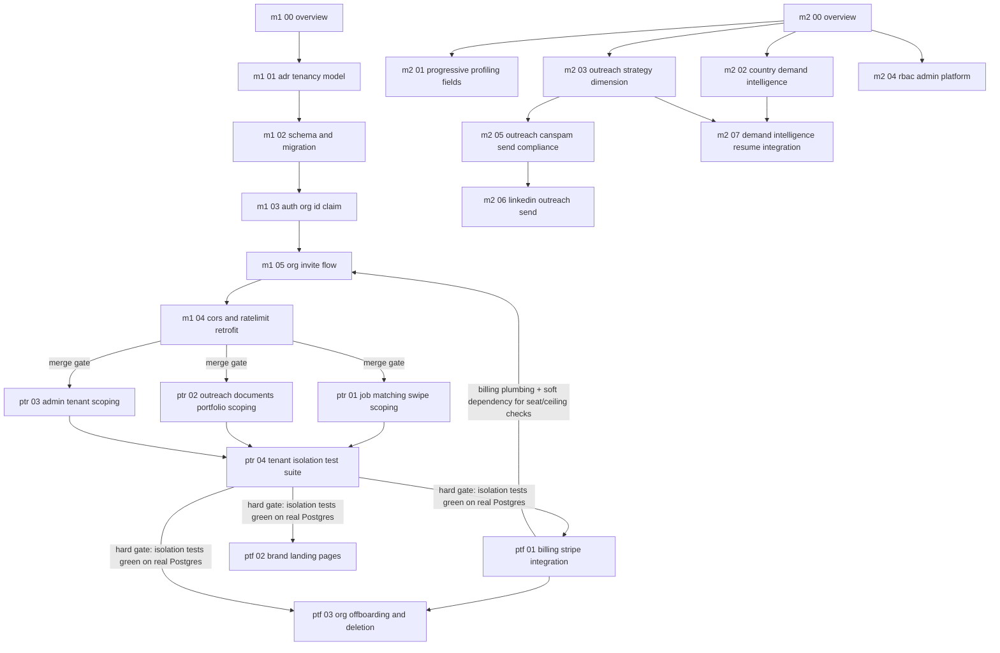

# Task Orchestration — Placement-Agency Platform

Planning docs for pivoting HyrePath from a single-tenant candidate-enrichment backend into a
**multi-tenant placement-agency platform**: staffing/recruiting agencies (each an "org") onboard
their own recruiters, who work their own pool of candidates, jobs, and outreach — all isolated
from every other agency's data.

This directory is **documentation only**. No application code is changed by these files
themselves; each `.md` is a self-contained spec for a later implementation PR.

Base branch for this planning work: `master-complete-foundation` (HEAD at time of writing:
`142b3756`, "Merge pull request #248 ... admin-module3-4-cors-ratelimit"). Working branch:
`feat/placement-agency-platform`.

## Why this structure

Two machines/agents work in parallel from day one:

- **Machine 1** owns `machine-1-tenancy-core/` — the foundational, blocking work: what a
  "tenant" is, how it's stored, how a request knows which tenant it belongs to. Every other
  track eventually depends on this, so it is deliberately small and merges first.
- **Machine 2** owns `machine-2-parallel-tracks/` — seven independent feature tracks that do
  **not** touch tenant scoping and do not depend on `machine-1` landing first. They can be
  built, reviewed, and merged in any order, at any time, concurrently with `machine-1`.

Once `machine-1-tenancy-core` merges to `master-complete-foundation`, a second wave begins:

- **`post-tenancy-retrofit/`** — goes back through the domains that already existed
  pre-tenancy (job matching/swipe, outreach/documents/portfolio, admin) and adds `org_id`
  scoping to their queries, so agency A can never see agency B's candidates, jobs, or
  messages. This wave is sequential internally (schema retrofits before query retrofits
  before the isolation test suite) and is a **hard gate**: nothing downstream merges until
  chunk `04-tenant-isolation-test-suite.md` passes green against real dockerized Postgres.
- **`post-tenancy-features/`** — net-new, tenant-aware features (billing, brand landing
  pages) that assume `org_id` scoping already exists everywhere. These only make sense once
  the retrofit wave's isolation tests are green.

## Dependency graph

`machine-2-*` nodes have **no edges into `machine-1-*` or `post-tenancy-*`** — that's the point.
`04-rbac-admin-platform.md` in machine-2 extends the *existing* `roles`/`permissions` tables
(already shipped, ADR 0015) with agency-specific role names; it does not need `org_id` to exist
to add a role row, so it stays parallel-safe. It becomes tenant-*aware* only later, in
`post-tenancy-retrofit/03-admin-tenant-scoping.md`.

`M1_05 --> PTF_03` is not drawn as its own edge above because it is already implied by
`PTF_01 --> PTF_03` and `M1_05`'s existing dependency on `PTF_01` for seat enforcement — `PTF_03`
does not itself depend on `M1_05` directly (org offboarding doesn't need the invite flow to
exist), so no direct edge is drawn between them.

`M1_05`'s edge back into `PTF_01` (labeled "billing plumbing + soft dependency...") is a **soft**
dependency, not a hard merge-order gate — see `M1_05`'s own file for how its seat-enforcement
check degrades safely (skips, does not raise) when `OrganizationSubscription` doesn't exist yet,
since `PTF_01` merges long after `M1_05` per the "Merge order" section below. The edge is drawn to
make the *eventual* full-functionality dependency visible on the graph, not to imply `M1_05`
cannot be implemented or merged before `PTF_01` — it explicitly can and, per merge order, must.

`M2_07`'s two incoming edges (`M2_02 --> M2_07`, `M2_03 --> M2_07`) mirror that chunk's own
"Depends on" section exactly: it needs `M2_02`'s `get_top_countries_for_role()` function and
`M2_03`'s established LLM prompt-construction append-pattern (`_STRATEGY_INSTRUCTIONS`'s
composition style) as the convention its own prompt-context addition follows. Per that chunk's
own ground-truth note, its actual data dependency (`desired_roles` on `CVData`) already exists
independent of `machine-2-parallel-tracks/01-progressive-profiling-fields.md`, so there is
deliberately **no** `M2_01 --> M2_07` edge.

## Merge order

1. **Anytime, any order, fully parallel:** all of `machine-2-parallel-tracks/*` may be
   implemented and merged to `master-complete-foundation` independently of everything else in
   this document. Each of the seven tracks (`01`-`07`) is its own branch/PR; they touch disjoint
   files (see each file's "Do not touch" list) so they can also land in any order relative to
   *each other* — with one soft ordering preference: `07` (demand-intelligence resume
   integration) reuses `02`'s read function and `03`'s prompt-append convention, so implement `07`
   after both, even though nothing structurally forces that order (it has no schema/migration
   dependency on either, only a code-import dependency).
2. **Must merge before any `post-tenancy-*` branch is created:** `machine-1-tenancy-core`,
   in its internal chunk order **`01 → 02 → 03 → 05 → 04`** (each chunk's migration/model depends
   on the previous chunk's schema). Note `05` (org invite flow) now sits *between* `03` and `04`,
   not after `04` — `05` depends on `03`'s `org_id` JWT claim/`OrgScopedUser` dependency and
   `02`'s `Organization` model, but has no dependency on `04`'s CORS/rate-limit retrofit at all,
   and `04`'s own new "Org-wide ceiling" section reads `OrganizationSubscription`
   (`post-tenancy-features/01`, not yet landed at this point either way) with its own independent
   fallback-config safety net — so there is no reason to make `04` block `05`. Placing `05` before
   `04` also means an org actually has a way to *invite members into it* before the org-aware
   rate-limiting/CORS retrofit lands, which is the more sensible product-readiness order. This is
   one branch, `feat/tenancy-core`, reviewed as up to five stacked PRs or one PR — implementer's
   choice — but it must be fully merged before step 3.
3. **Sequential, after step 2:** `post-tenancy-retrofit/01`, `02`, `03` (parallel-safe *among
   themselves* — they touch disjoint modules — but all three must exist before `04`), then
   `04-tenant-isolation-test-suite.md` (depends on 01-03's scoping actually being in place to
   have something to test).
4. **Only after `post-tenancy-retrofit/04`'s test suite is green on real dockerized Postgres in
   CI:** `post-tenancy-features/01`, `02`, and `03` may branch and merge, in any order relative
   to `01`/`02` — but `03` (org offboarding/deletion) additionally depends on `01`'s
   `OrganizationSubscription`/Stripe customer linkage (for its Stage 3/4 financial-record-
   retention and Stripe-redaction steps), so `03` must merge after `01`, even though `01` and `02`
   remain mutually order-independent.

## Subagent role assignment

| Track | Developer | Reviewer | Tester | Notes |
|---|---|---|---|---|
| `machine-1-tenancy-core` (all 5 chunks) | 1 developer subagent, sequential dispatch (chunk N waits for chunk N-1's migration to exist; internal order is now `01→02→03→05→04`) | 1 reviewer subagent per chunk, gates progression to next chunk | 1 tester subagent after chunk `04`, full auth+CORS+rate-limit+invite-flow test pass | Single-threaded by design — this is the track everything else waits on, so speed here matters more than parallelism |
| `machine-2-parallel-tracks/01, 02, 04` | 1 developer subagent per track, dispatched in parallel | 1 reviewer subagent per track | 1 tester subagent per track | Independent CV/profiling, JobSpy-country, and RBAC domains, zero file overlap |
| `machine-2-parallel-tracks/03 → 05 → 06` | 1 developer subagent, sequential within this sub-chain (06 imports the schema 03 defines and the compliance primitives 05 defines) | 1 reviewer subagent per chunk | 1 tester subagent after `06` | This sub-chain is internally sequential even though the whole `machine-2` track is parallel to `machine-1` |
| `machine-2-parallel-tracks/07` | 1 developer subagent, dispatched after `02` and `03` (code-import dependency, not a schema one — see "Merge order" §1) | 1 reviewer subagent | 1 tester subagent (regression-byte-identical-when-disabled check is release-blocking for this chunk specifically) | Small, additive prompt-context chunk — no new table, no new migration |
| `post-tenancy-retrofit/01, 02, 03` | 3 developer subagents in parallel (disjoint modules) | 3 reviewer subagents in parallel | held until all 3 land | Each retrofits one domain; see each file's file list |
| `post-tenancy-retrofit/04` | 1 developer + 1 tester subagent, dispatched only after 01-03 all merged | 1 reviewer subagent, **release-blocking** | tester subagent owns the real-Postgres CI job | This is the hard gate — see below |
| `post-tenancy-features/01, 02` | 1 developer subagent per track, parallel to each other | 1 reviewer subagent per track | 1 tester subagent per track | Only dispatched after the hard gate passes |
| `post-tenancy-features/03` | 1 developer subagent, dispatched after `01` merges (needs `OrganizationSubscription`/Stripe customer linkage) | 1 reviewer subagent, treats the staged-deletion ordering (soft-delete → grace period → hard-delete → Stripe redaction → tombstone) as a correctness-blocking review item, not a style nit | 1 tester subagent — must cover the grace-period-not-elapsed 409 path and the Stripe-redaction ordering assertion | Also responsible for creating the real `docs/adr/00XX-org-offboarding-and-data-retention.md` file (this chunk's own migration/router/service files only *spec* that ADR as a deliverable, matching `post-tenancy-features/01`'s own ADR-deliverable precedent) |

## Hard gate rule

**No `post-tenancy-retrofit` branch — and no `post-tenancy-features` branch — merges to
`master-complete-foundation` until `post-tenancy-retrofit/04-tenant-isolation-test-suite.md`'s
test suite passes green against a real dockerized Postgres instance (`docker compose -f
backend/docker/docker-compose.yml up postgres`, not SQLite).** SQLite is fine for the rest of
this repo's day-to-day dev loop (ADR 0002), but cross-tenant isolation bugs are exactly the
class of bug that a permissive, single-file SQLite test DB can hide (no real row-level security,
no connection-pooling edge cases, no concurrent-session interleaving) — so this one suite is
explicitly carved out to require Postgres, matching how `docker-compose.yml`'s own `migrate`
service already runs migrations against Postgres before `api` starts.

The reviewer subagent for `04-tenant-isolation-test-suite.md` must refuse to approve the PR if:

- the suite runs against SQLite instead of Postgres, or
- any test in the suite is skipped/xfail'd instead of passing, or
- the suite does not cover all three domains retrofitted in `01`-`03` (job matching/swipe,
  outreach/documents/portfolio, admin).

## Branch naming convention

- `feat/tenancy-core` — machine-1, all five chunks (including `05-org-invite-flow.md`)
- `feat/progressive-profiling-fields`, `feat/country-demand-intelligence`,
  `feat/outreach-strategy-dimension`, `feat/rbac-admin-platform`,
  `feat/outreach-canspam-compliance`, `feat/linkedin-outreach-send`,
  `feat/demand-intelligence-resume-integration` — machine-2, one branch per track (the
  `03 → 05 → 06` sub-chain may be three stacked branches or three commits on one branch,
  implementer's choice, as long as each is reviewable independently)
- `feat/job-matching-tenant-scoping`, `feat/outreach-docs-portfolio-tenant-scoping`,
  `feat/admin-tenant-scoping`, `feat/tenant-isolation-tests` — post-tenancy-retrofit
- `feat/billing-stripe`, `feat/brand-landing-pages`, `feat/org-offboarding-and-deletion` —
  post-tenancy-features

All branches target `master-complete-foundation` directly (this repo does not use a long-lived
`develop` branch). Per the repo's git workflow rule, no branch listed here is merged by the
implementing agent — each opens a PR and stops for human review.

## Assumptions this README makes (flag if wrong)

- "Org" and "agency" and "tenant" are used interchangeably in this doc set; the schema chunk
  (`machine-1-tenancy-core/02-schema-and-migration.md`) is the single source of truth for the
  actual table/column names.
- A user belongs to exactly one org (no cross-org user membership in v1) — see that chunk's
  "Ambiguities resolved" section for why.
- "Placement agency" candidates and jobs are the *same* `job_matching`/`documents`/`portfolio`
  tables used today by direct candidates, scoped by `org_id`, not a parallel schema — see
  `post-tenancy-retrofit/01` and `02`.

## Gaps closed since initial planning (2026-08-23)

A critical review of this doc set found 9 gaps in the original planning. All 9 are now closed;
this section is the traceability index for anyone auditing the doc set later.

| # | Gap | Closed by |
|---|-----|-----------|
| 1 | No invite/signup flow into an org | `machine-1-tenancy-core/05-org-invite-flow.md` (new chunk) |
| 2 | Country-demand data doesn't feed resume/outreach personalization | `machine-2-parallel-tracks/07-demand-intelligence-resume-integration.md` (new chunk) |
| 2b | India/Middle East JSearch country/language coverage unverified | `machine-2-parallel-tracks/02-country-demand-intelligence.md` (edited "Verification" section — added missing ISO2 mappings and a `language`-parameter check) |
| 3 | `ManualJobEntry` org-scoping left as "check carefully at implementation time" | `post-tenancy-retrofit/01-job-matching-and-swipe-tenant-scoping.md` (edited — definitive decision + reusable ownership-test rule) |
| 4a | `LinkedInSendTask` org-scoping left as "implementer's choice" | `post-tenancy-retrofit/02-outreach-documents-portfolio-tenant-scoping.md` and `machine-2-parallel-tracks/06-linkedin-outreach-send.md` (both edited — definitive decision: transitive join, no duplicate column) |
| 4b | No frontend UI coverage for four machine-2 backend-only chunks | `machine-2-parallel-tracks/01-progressive-profiling-fields.md`, `02-country-demand-intelligence.md`, `03-outreach-strategy-dimension.md`, `04-rbac-admin-platform.md` (each edited — new "Frontend" section appended) |
| 5 | No org deletion/offboarding/data-retention spec | `post-tenancy-features/03-org-offboarding-and-deletion.md` (new chunk) |
| 6 | Seat enforcement explicitly deferred with no follow-up owner | `machine-1-tenancy-core/05-org-invite-flow.md` (new chunk, enforcement lives at its invite-creation endpoint) + `post-tenancy-features/01-billing-stripe-integration.md` (edited — cross-reference note added beneath the original scope-cut) |
| 7 | No org-wide rate-limit ceiling, only per-caller key-format change | `machine-1-tenancy-core/04-cors-and-ratelimit-retrofit.md` (edited — new "Org-wide ceiling" section, second additive Redis key, billing-soft-dependency fallback config) |

Note gap `4` in the original review bundled two distinct issues (the `LinkedInSendTask` scoping
ambiguity, and missing frontend coverage) — both are listed above as `4a`/`4b` for precision,
since they're closed by entirely different files.
